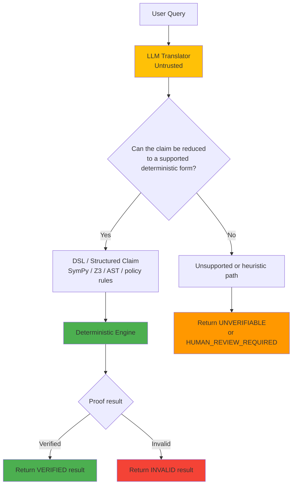
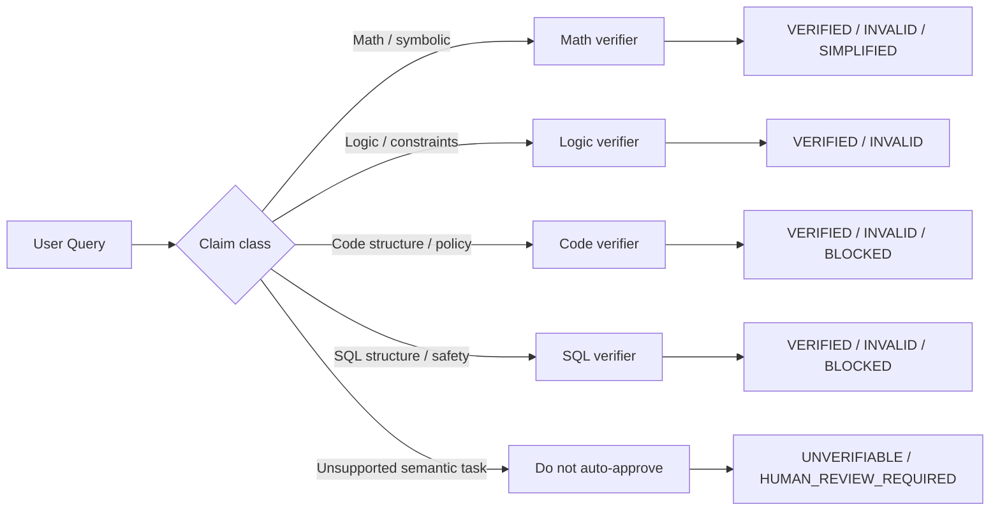
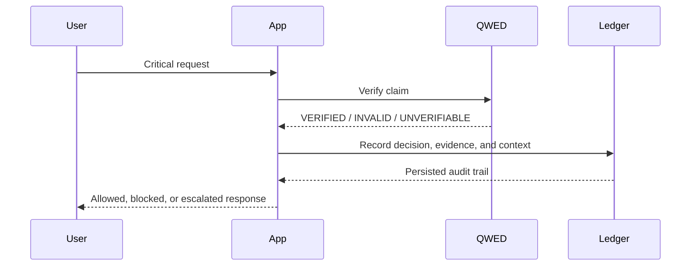
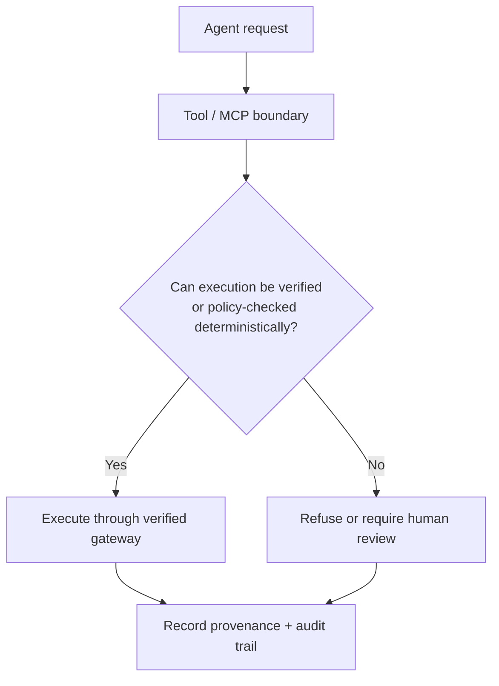

# Architecture Diagrams

Visual guides to the current QWED trust-boundary model.

---

## 1. Deterministic Verification Flow

**How QWED should handle critical claims:**

```mermaid
graph TB
    A["User Query"] --> B["LLM Translator<br/>Untrusted"]
    B --> C{"Can the claim be reduced<br/>to a supported deterministic form?"}
    C -->|Yes| D["DSL / Structured Claim<br/>SymPy / Z3 / AST / policy rules"]
    C -->|No| E["Unsupported or heuristic path"]
    D --> F["Deterministic Engine"]
    F --> G{"Proof result"}
    G -->|Verified| H["Return VERIFIED result"]
    G -->|Invalid| I["Return INVALID result"]
    E --> J["Return UNVERIFIABLE<br/>or HUMAN_REVIEW_REQUIRED"]

    style B fill:#ffc107
    style F fill:#4caf50
    style H fill:#4caf50
    style I fill:#f44336
    style J fill:#ff9800
```

**Key insight:** the LLM may translate, summarize, or extract, but the trust decision belongs to the deterministic layer.

---

## 2. Result States Matter

QWED should keep these categories separate:

| State | Meaning |
|------|---------|
| `VERIFIED` | A supported deterministic check proved the claim |
| `INVALID` | A supported deterministic check disproved the claim |
| `UNVERIFIABLE` | The claim could not be proved with the available deterministic machinery |
| `HEURISTIC` | A useful signal exists, but not a proof |
| `SIMPLIFIED` | An expression was transformed, not proved |

Do not collapse these into a single "confidence" field.

Note: `BLOCKED` and `HUMAN_REVIEW_REQUIRED` are handling dispositions, not proof states.
Keep verification state (`VERIFIED`, `INVALID`, `UNVERIFIABLE`, `HEURISTIC`, `SIMPLIFIED`)
separate from execution policy.

---

## 3. Domain Routing

```mermaid
graph LR
    A["User Query"] --> B{"Claim class"}

    B -->|Math / symbolic| C["Math verifier"]
    B -->|Logic / constraints| D["Logic verifier"]
    B -->|Code structure / policy| E["Code verifier"]
    B -->|SQL structure / safety| F["SQL verifier"]
    B -->|Unsupported semantic task| G["Do not auto-approve"]

    C --> H["VERIFIED / INVALID / SIMPLIFIED"]
    D --> I["VERIFIED / INVALID"]
    E --> J["VERIFIED / INVALID / BLOCKED"]
    F --> K["VERIFIED / INVALID / BLOCKED"]
    G --> L["UNVERIFIABLE / HUMAN_REVIEW_REQUIRED"]
```

---

## 4. Safe Error Handling

**Fail closed, not gracefully open:**

```mermaid
graph TD
    A["Critical query"] --> B["Try primary translation path"]
    B --> C{"Translation + verification succeeded?"}
    C -->|Yes| D["Return VERIFIED / INVALID result"]
    C -->|No| E["Try alternate translation path"]
    E --> F{"Verification succeeded?"}
    F -->|Yes| D
    F -->|No| G["Mark request UNVERIFIABLE"]
    G --> H["Log, alert, and preserve context"]
    H --> I["Block, quarantine, or route to human review"]

    style D fill:#4caf50
    style G fill:#ff9800
    style I fill:#f44336
```

What should **not** happen:

- returning a conservative fallback value
- lowering a confidence score and continuing
- silently switching to unverified LLM output

---

## 5. Audit and Provenance

```mermaid
sequenceDiagram
    participant User
    participant App
    participant QWED
    participant Ledger

    User->>App: Critical request
    App->>QWED: Verify claim
    QWED-->>App: VERIFIED / INVALID / UNVERIFIABLE
    App->>Ledger: Record decision, evidence, and context
    Ledger-->>App: Persisted audit trail
    App-->>User: Allowed, blocked, or escalated response
```

Auditability is valuable, but auditability is not proof. A logged heuristic answer is still heuristic.

---

## 6. Agent and MCP Boundary

```mermaid
graph TB
    A["Agent request"] --> B["Tool / MCP boundary"]
    B --> C{"Can execution be verified<br/>or policy-checked deterministically?"}
    C -->|Yes| D["Execute through verified gateway"]
    C -->|No| E["Refuse or require human review"]

    D --> F["Record provenance + audit trail"]
    E --> F
```

Modern QWED education should teach that:

- tool descriptions can be poisoned
- execution provenance matters
- replay and context binding matter
- unsupported execution requests must fail closed

---

## 7. What This Architecture Is Not

This repo should not teach:

- "100% confidence" as the label for proof
- "safe default" as a substitute for verification
- "retry until something works" as a trust strategy
- "observed output" as equivalent to "audited output"

The curriculum should teach trust-boundary engineering, not just AI convenience patterns.
