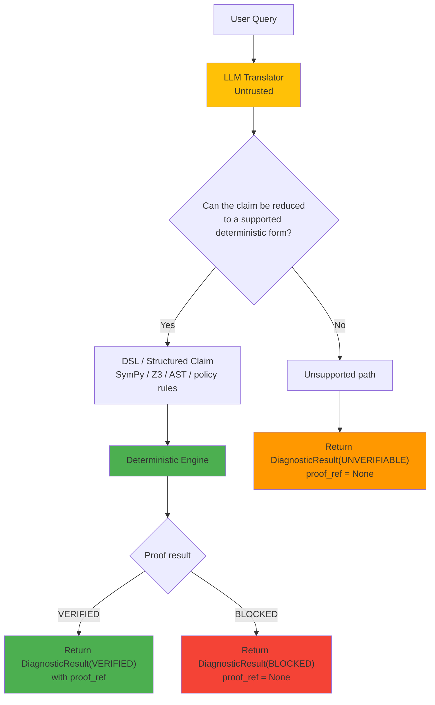
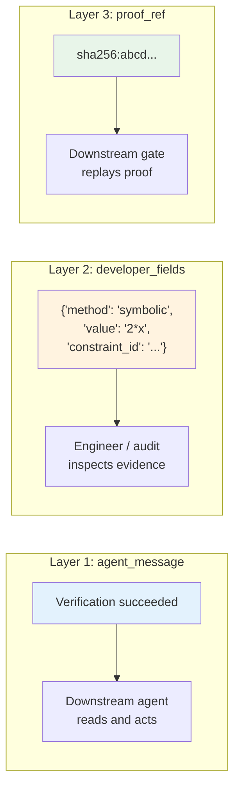
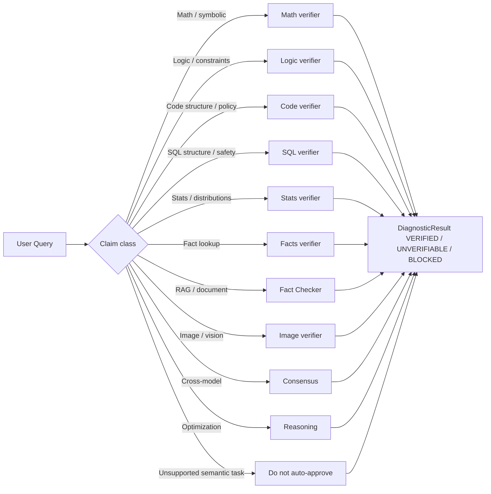
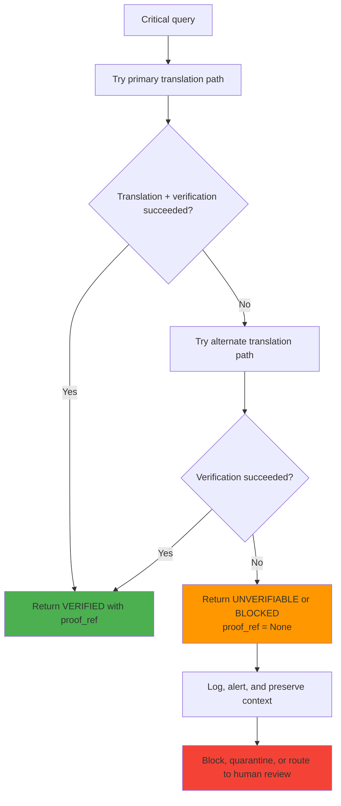
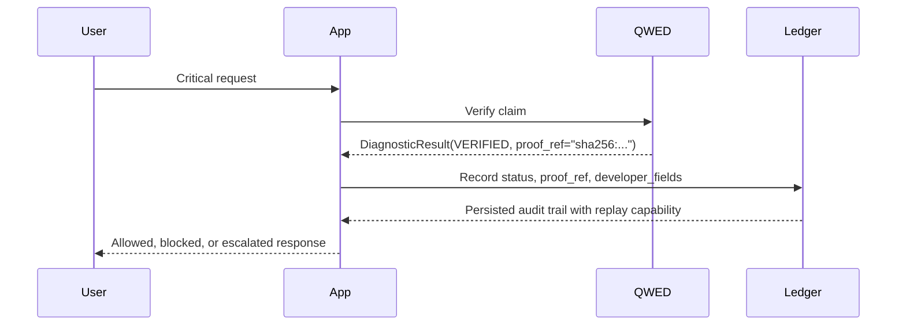
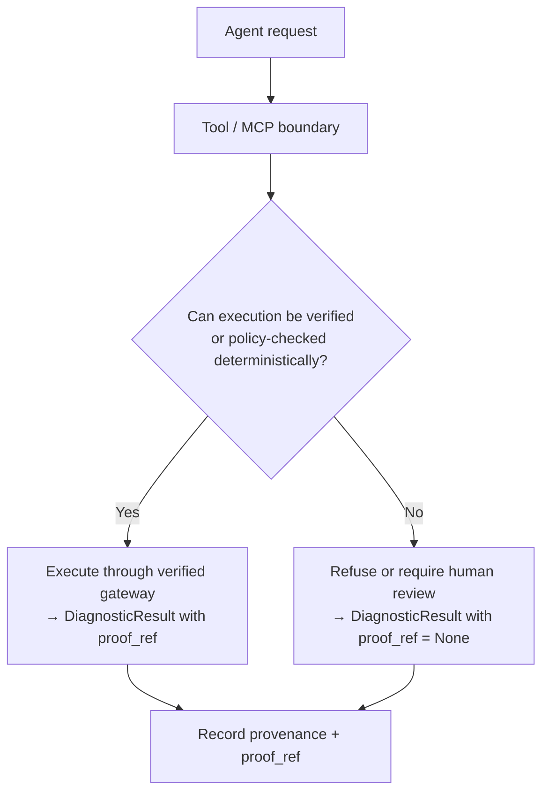

# Architecture Diagrams

Visual guides to the QWED trust-boundary model.

---

## 1. Deterministic Verification Flow

**How QWED handles critical claims:**


```mermaid
graph TB
    A["User Query"] --> B["LLM Translator<br/>Untrusted"]
    B --> C{"Can the claim be reduced<br/>to a supported deterministic form?"}
    C -->|Yes| D["DSL / Structured Claim<br/>SymPy / Z3 / AST / policy rules"]
    C -->|No| E["Unsupported path"]
    D --> F["Deterministic Engine"]
    F --> G{"Proof result"}
    G -->|VERIFIED| H["Return DiagnosticResult(VERIFIED)<br/>with proof_ref"]
    G -->|BLOCKED| I["Return DiagnosticResult(BLOCKED)<br/>proof_ref = None"]
    E --> J["Return DiagnosticResult(UNVERIFIABLE)<br/>proof_ref = None"]

    style B fill:#ffc107
    style F fill:#4caf50
    style H fill:#4caf50
    style I fill:#f44336
    style J fill:#ff9800
```

**Key insight:** the LLM may translate, summarize, or extract, but the trust decision belongs to the deterministic layer. Every response carries a `proof_ref` — present only when `VERIFIED`.

---

## 2. Result States — Three, Not Five

QWED uses exactly three diagnostic states (Issue #204, `DiagnosticResult`):

| State | Meaning | proof_ref | Authority |
|-------|---------|-----------|-----------|
| `VERIFIED` | A deterministic engine proved the claim | `sha256:...` (set) | Authoritative — admissible for control flow |
| `UNVERIFIABLE` | The claim could not be proved with available deterministic machinery | `None` | Non-authoritative — must not drive control flow |
| `BLOCKED` | Verification could not even be attempted (parse error, config failure, security violation) | `None` | Non-authoritative — must not drive control flow |

`HEURISTIC` and `SIMPLIFIED` are not states — they are optional metadata carried inside `developer_fields.advisory_checks`. A heuristic signal is useful information, but it is not a verification result. Do not assign it a status code.

**Authority contract (the mechanical rule):**
- `proof_ref is not None` → authoritative, downstream gates MAY admit for control flow
- `proof_ref is None` → non-authoritative, downstream gates MUST NOT admit for control flow

No separate `authoritative` boolean needed. The presence of `proof_ref` **is** the authority bit.

---

## 3. Three-Layer Diagnostic Result

Every `DiagnosticResult` has three layers:

```
┌─────────────────────────────────────────────┐
│  Layer 1: agent_message (str)               │
│  Agent-safe diagnostic text, no internals   │
├─────────────────────────────────────────────┤
│  Layer 2: developer_fields (Dict[str, Any]) │
│  Structured evidence, constraint_id,        │
│  advisory_checks, engine metadata           │
├─────────────────────────────────────────────┤
│  Layer 3: proof_ref (Optional[str])         │
│  sha256 hash of proof artifact             │
│  PRESENT ↔ VERIFIED ↔ Authoritative        │
└─────────────────────────────────────────────┘
```


```mermaid
graph LR
    subgraph "Layer 1: agent_message"
        A1["Verification succeeded"] --> A2["Downstream agent<br/>reads and acts"]
    end
    subgraph "Layer 2: developer_fields"
        B1["{'method': 'symbolic',<br/>'value': '2*x',<br/>'constraint_id': '...'}"] --> B2["Engineer / audit<br/>inspects evidence"]
    end
    subgraph "Layer 3: proof_ref"
        C1["sha256:abcd..."] --> C2["Downstream gate<br/>replays proof"]
    end

    style A1 fill:#e3f2fd
    style B1 fill:#fff3e0
    style C1 fill:#e8f5e9
```

### Layer Separation — Diagnostics ≠ Explainability

QWED keeps three concerns structurally separate (Principle 9):

| Layer | Audience | Content | Required? |
|-------|----------|---------|-----------|
| `agent_message` | Downstream agents / LLM consumers | Human-readable diagnostic: what happened, what to do next | Always |
| `developer_fields` | Engineers, audit, compliance | Structured evidence: constraints checked, solver traces, policy violations | Always (may be empty) |
| `proof_ref` | Downstream gates, replay, provenance | Cryptographic hash binding the verdict to the exact evidence that justified it | Only on `VERIFIED` |

This separation prevents the agent from over-interpreting internals and prevents engineers from treating "good explainability" as proof.

---

## 4. Domain Routing

The current ecosystem provides **11+ verification engines** across math, logic, code, data, and image domains, plus **7+ agent security guards** for runtime protection:

### Verification Engines

| # | Engine | Technology | Domain |
|---|--------|-----------|--------|
| 1 | **Math** | SymPy | Symbolic arithmetic, calculus, algebra |
| 2 | **Logic** | Z3 | SAT solving, constraint satisfaction |
| 3 | **Code** | AST analysis | Python security, code structure |
| 4 | **SQL** | SQLGlot | SQL syntax, structure, safety |
| 5 | **Stats** | DataFrame sandbox | Statistical properties, distributions |
| 6 | **Facts (Exact)** | String matching | Exact fact lookups, ground truth |
| 7 | **Fact Checker** | RAG/NLI | Document-grounded claim verification |
| 8 | **Image** | Vision models | Image content verification |
| 9 | **Consensus** | Multi-model | Cross-model agreement |
| 10 | **Reasoning** | Optimization | Logic optimization, vacuity detection |
| 11 | **Process** | IRAC/Milestone | Process determinism, compliance |
| 12+ | **Schema**, **Graph**, **DSL Logic** | Various | Schema conformance, knowledge graph facts, domain-specific DSL |

### Agent Security Guards

| # | Guard | Purpose |
|---|-------|---------|
| 1 | **SystemGuard** | Shell command verification |
| 2 | **ConfigGuard** | Secrets scanning in config |
| 3 | **RAGGuard** | RAG retrieval mismatch prevention |
| 4 | **MCPPoisonGuard** | MCP tool definition poisoning detection |
| 5 | **ExfiltrationGuard** | Runtime data exfiltration prevention |
| 6 | **SelfInitiatedCoTGuard** | S-CoT logic path verification |
| 7 | **ProcessVerifier** | Deterministic process validation (IRAC) |
| 8 | **StartupHookGuard** | Environment integrity / startup hook detection |


```mermaid
graph LR
    A["User Query"] --> B{"Claim class"}

    B -->|Math / symbolic| C["Math verifier"]
    B -->|Logic / constraints| D["Logic verifier"]
    B -->|Code structure / policy| E["Code verifier"]
    B -->|SQL structure / safety| F["SQL verifier"]
    B -->|Stats / distributions| G["Stats verifier"]
    B -->|Fact lookup| H["Facts verifier"]
    B -->|RAG / document| I["Fact Checker"]
    B -->|Image / vision| J["Image verifier"]
    B -->|Cross-model| K["Consensus"]
    B -->|Optimization| L["Reasoning"]
    B -->|Unsupported semantic task| M["Do not auto-approve"]

    C --> N["DiagnosticResult VERIFIED / UNVERIFIABLE / BLOCKED"]
    D --> N
    E --> N
    F --> N
    G --> N
    H --> N
    I --> N
    J --> N
    K --> N
    L --> N
    M --> N
```

All domain engines return the same `DiagnosticResult` type. The difference is in `developer_fields`, not the status enum.

---

## 5. Safe Error Handling — Fail Closed

**Fail closed, not gracefully open:**


```mermaid
graph TD
    A["Critical query"] --> B["Try primary translation path"]
    B --> C{"Translation + verification succeeded?"}
    C -->|Yes| D["Return VERIFIED with proof_ref"]
    C -->|No| E["Try alternate translation path"]
    E --> F{"Verification succeeded?"}
    F -->|Yes| D
    F -->|No| G["Return UNVERIFIABLE or BLOCKED<br/>proof_ref = None"]
    G --> H["Log, alert, and preserve context"]
    H --> I["Block, quarantine, or route to human review"]

    style D fill:#4caf50
    style G fill:#ff9800
    style I fill:#f44336
```

What must **not** happen:

- returning a conservative fallback value
- lowering a confidence score and continuing
- silently switching to unverified LLM output
- treating `UNVERIFIABLE` as "verified with caveats"

---

## 6. Audit and Provenance


```mermaid
sequenceDiagram
    participant User
    participant App
    participant QWED
    participant Ledger

    User->>App: Critical request
    App->>QWED: Verify claim
    QWED-->>App: DiagnosticResult(VERIFIED, proof_ref="sha256:...")
    App->>Ledger: Record status, proof_ref, developer_fields
    Ledger-->>App: Persisted audit trail with replay capability
    App-->>User: Allowed, blocked, or escalated response
```

The `proof_ref` makes the audit trail replayable — any downstream gate can independently verify that the evidence hash matches the verdict.

Auditability is valuable, but auditability is not proof. A logged heuristic is still heuristic, even with a pretty audit trail.

---

## 7. Agent and MCP Boundary


```mermaid
graph TB
    A["Agent request"] --> B["Tool / MCP boundary"]
    B --> C{"Can execution be verified<br/>or policy-checked deterministically?"}
    C -->|Yes| D["Execute through verified gateway<br/>→ DiagnosticResult with proof_ref"]
    C -->|No| E["Refuse or require human review<br/>→ DiagnosticResult with proof_ref = None"]

    D --> F["Record provenance + proof_ref"]
    E --> F
```

Modern QWED education should teach that:

- tool descriptions can be poisoned
- execution provenance matters — `proof_ref` enables replay detection
- replay and context binding matter
- unsupported execution requests must fail closed
- the same `DiagnosticResult` type spans all boundaries

---

## 8. What This Architecture Is Not

This curriculum should not teach:

- "100% confidence" as the label for proof
- "safe default" as a substitute for verification
- "retry until something works" as a trust strategy
- "observed output" as equivalent to "audited output"
- `HEURISTIC` or `SIMPLIFIED` as verification status codes

The curriculum teaches trust-boundary engineering, not AI convenience patterns.
