# Architecture Diagrams

Visual guides to understanding QWED's neurosymbolic verification system.

---

## 1. The Neurosymbolic Flow

**How QWED verifies LLM outputs:**

**Key Insight:** LLM translates, symbolic engine proves. Never trust LLM to compute!

---

## 2. The 8 Verification Engines

**Domain-specific routing:**

```mermaid
graph LR
    A[User Query] --> B{Domain<br/>Detector}
    
    B -->|Math| C[Math Verifier<br/>SymPy + NumPy]
    B -->|Logic| D[Logic Verifier<br/>Z3 Solver]
    B -->|Code| E[Code Security<br/>AST + Semgrep]
    B -->|SQL| F[SQL Validator<br/>SQLGlot]
    B -->|Stats| G[Stats Engine<br/>Pandas]
    B -->|Facts| H[Fact Checker<br/>NLI Model]
    B -->|Images| I[Image Verifier<br/>OpenCV]
    B -->|Unknown| J[Consensus<br/>Multi-LLM]
    
    C --> K[✅ Verified Result]
    D --> K
    E --> K
    F --> K
    G --> K
    H --> K
    I --> K
    J --> K
    
    style C fill:#2196f3
    style D fill:#9c27b0
    style E fill:#f44336
    style F fill:#ff9800
    style G fill:#4caf50
    style H fill:#00bcd4
    style I fill:#e91e63
    style J fill:#607d8b
```

---

## 3. PII Masking Flow

**HIPAA/GDPR compliance:**

---

## 4. LangChain Integration

**Agent + QWED flow:**

---

## 5. Production Deployment Architecture

**Scalable verification system:**

---

## 6. Error Handling Flow

**Graceful degradation:**

```mermaid
graph TD
    A[Calculate Query] --> B[Try Primary Provider<br/>OpenAI]
    B --> C{Success?}
    C -->|✅| D[Return Verified Result]
    C -->|❌| E[Try Fallback<br/>Anthropic]
    E --> F{Success?}
    F -->|✅| D
    F -->|❌| G[Try Local<br/>Ollama]
    G --> H{Success?}
    H -->|✅| D
    H -->|❌| I[Use Conservative<br/>Fallback Value]
    I --> J[Log Warning<br/>+ Alert Ops]
    J --> K[Return Unverified<br/>Confidence: 0%]
    
    style D fill:#4caf50
    style I fill:#ff9800
    style K fill:#f44336
```

---

## Legend

- **Yellow/Orange** 🟨 = LLM components (probabilistic)
- **Green** 🟩 = Symbolic engines (deterministic)
- **Blue** 🟦 = Infrastructure/Data
- **Red** 🟥 = Errors/Failures
- **Purple** 🟪 = Logic/Constraints

---

## Usage in Course

These diagrams appear in:
- Module 2: Neurosymbolic Theory
- Module 3: Production Patterns
- Module 4: Advanced Architectures

**Mermaid rendering:** GitHub automatically renders these diagrams!
