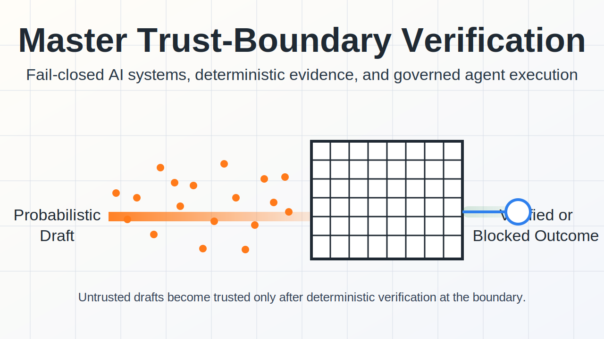
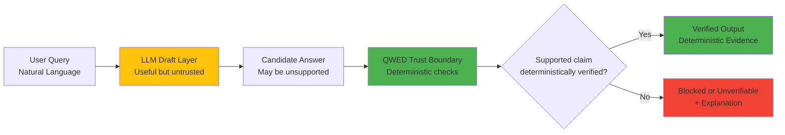

# Master Trust-Boundary Verification for AI Systems

**Free, open-source course on deterministic AI verification, fail-closed trust boundaries, and governed agent systems**

[](LICENSE)
[](https://github.com/QWED-AI/qwed-learning/stargazers)

*Part of [QWED-AI](https://github.com/QWED-AI/qwed-verification) | Member of [NVIDIA Inception Program](https://www.nvidia.com/en-us/startups/)*

---

**Jump to:**
[Video Intro](#video-intro) | [Your Progress](#your-learning-progress) | [Choose Your Path](#choose-your-path) | [Course Map](#course-map-at-a-glance) | [FAQ](#quick-questions-before-you-start)

---

<div align="center" id="video-intro">

[](https://youtu.be/DjFOviJMMWY)

**[Watch Course Introduction](https://youtu.be/DjFOviJMMWY)** *(5 min)*

</div>

---

## Your Learning Progress

<details open>
<summary><strong>Track Your Progress (Click to Expand)</strong></summary>

**Module Completion:**
- [ ] [Module 0: Prerequisites](module-0-prerequisites/README.md) _(20 min)_
- [ ] [Module 1: The Crisis](module-1-the-crisis/README.md) _(30 min)_
- [ ] [Module 1.5: Physics of Failure](module-1.5-physics-of-failure/README.md) _(45 min)_
- [ ] [Module 2: The Theory](module-2-neurosymbolic-theory/README.md) _(45 min)_
- [ ] [Module 3: Hands-On](module-3-hands-on/README.md) _(60 min)_
- [ ] [Module 4: Advanced](module-4-advanced/README.md) _(45 min)_
- [ ] [Module 5: Verification Landscape](module-5-verification-landscape/README.md) _(45 min)_
- [ ] [Module 6: Domains](module-6-domains/README.md) _(60 min)_
- [ ] [Module 7: Context Engineering](module-7-context-engineering/README.md) _(60 min)_
- [ ] [Module 8: Agentic Integration](module-8-agentic-workflows/README.md) _(60 min)_
- [ ] [Module 9: DevSecOps](module-9-devsecops/README.md) _(45 min)_
- [ ] [Module 10: Advanced Patterns](module-10-advanced-patterns/README.md) _(45 min)_
- [ ] [Module 11: Legal Auditor](module-11-legal-auditor/README.md) _(60 min)_
- [ ] [Module 12: Agentic Security](module-12-agentic-security/README.md) _(60 min)_
- [ ] [Module 13: Secure Orchestration](module-13-secure-orchestration/README.md) _(75 min)_ [New]

**Pro Tip:** Save this page or fork the repo if you want a persistent progress checklist.

</details>

---

## Choose Your Path

<details open>
<summary><strong>Which role matches you? (Click to Expand)</strong></summary>

#### **Backend Developer** _(90 mins)_
Learning to integrate LLM verification into APIs
```
Module 0 -> Module 1 -> Module 3 (Hands-On) -> Module 9 (DevSecOps)
```
-> **[Start Here](module-0-prerequisites/README.md)**

#### **Finance/Compliance** _(2 hours)_
Building verification for regulated workflows
```
Module 1 -> Module 2 -> Module 6 (Finance Domain) -> Module 11 (Legal Auditor)
```
-> **[Start Here](module-1-the-crisis/README.md)**

#### **AI/ML Engineer** _(Full Course)_
Master verification theory and advanced patterns
```
All modules + Capstone Project
```
-> **[Start Here](module-0-prerequisites/README.md)**

#### **Student/Researcher** _(Theory Focus, 90 mins)_
Understanding neurosymbolic AI fundamentals
```
Module 2 -> Module 1.5 -> Module 5 -> Module 10
```
-> **[Start Here](module-2-neurosymbolic-theory/README.md)**

</details>

**How Much Time Do You Have?**
- **30 mins:** [Module 1 (The Crisis)](module-1-the-crisis/README.md)
- **2 hours:** [Core Developer Path (Hands-On)](module-3-hands-on/README.md)
- **Full Course:** 8-10 hours (spread over 2 weeks)

---

## Course Map at a Glance

| Module | Time | Focus | Best For | Difficulty |
|--------|------|-------|----------|------------|
| [0: Prerequisites](module-0-prerequisites/) | 20m | Fundamentals | New to LLMs | Easy |
| [1: The Problem](module-1-the-crisis/) | 30m | The Problem | Everyone | Easy |
| [2: Theory](module-2-neurosymbolic-theory/) | 45m | Logic | Engineers | Hard |
| [3: Hands-On](module-3-hands-on/) | 60m | Code | Builders | Medium |
| [6: Domains](module-6-domains/) | 60m | Industry | Business | Easy |
| [11: Legal](module-11-legal-auditor/) | 60m | Law | Legal Tech | Medium |
| [12: Security](module-12-agentic-security/) | 60m | Agentic AI | Security | Hard |
| [13: Orchestration](module-13-secure-orchestration/) | 75m | Multi-Agent | Architects | Hard [New] |

---

## Why This Course?

**The Problem:**
- Developers ship LLM-powered apps without verification.
- Too few learning resources teach verification fundamentals as a trust-boundary problem.

**After This Course:**
- Understand determinism vs probabilistic systems
- Implement fail-closed verification boundaries in production
- Distinguish proof, simplification, validation, and heuristic output
- Design AI systems that block unsupported trust claims

---

## The Core Concept: Draft vs. Decision Boundary

**Think of it this way:**

**An LLM produces a draft**
- Helpful for translation, summarization, and first-pass reasoning
- May still be unsupported, inconsistent, or context-confused
- Must not silently decide a high-stakes outcome on its own

**QWED is the decision boundary**
- Verifies supported claims with deterministic checks
- Separates `VERIFIED`, `INVALID`, `UNVERIFIABLE`, and other non-pass states
- Blocks or escalates when proof is unavailable

**Visual Workflow:**


```mermaid
graph LR
    A["User Query<br/>Natural Language"] --> B["LLM Draft Layer<br/>Useful but untrusted"]
    B --> C["Candidate Answer<br/>May be unsupported"]
    C --> D["QWED Trust Boundary<br/>Deterministic checks"]
    D --> E{"Supported claim<br/>deterministically verified?"}
    E -->|"Yes"| F["Verified Output<br/>Deterministic Evidence"]
    E -->|"No"| G["Blocked or Unverifiable<br/>+ Explanation"]

    style B fill:#ffc107
    style D fill:#4caf50
    style F fill:#4caf50
    style G fill:#f44336
```

---

## Quick Questions Before You Start

<details>
<summary><strong>What is the most important concept in this course?</strong></summary>

**Proof is not confidence.**

QWED is about deterministic verification and explicit non-pass states, not stronger confidence scores.

Start here before the rest of the curriculum:

- [Module 0: Proof vs. Confidence](module-0-prerequisites/00-proof-vs-confidence.md)

</details>

<details>
<summary><strong>Do I need a GPU?</strong></summary>

No. You can run everything locally with:
- Ollama (free, runs on CPU)
- Or the OpenAI API (cheap for learning)

[See setup guide ->](module-3-hands-on/README.md)

</details>

<details>
<summary><strong>How long is this really?</strong></summary>

- **Fast track (skipping videos):** 3-4 hours
- **Full course with videos:** 8-10 hours
- **With hands-on capstone:** 12-15 hours

Spread over 2-3 weeks at your pace.

</details>

<details>
<summary><strong>Will I get certified?</strong></summary>

GitHub does not issue certificates, but you will build:
- A governed banking agent for your portfolio
- Production-ready verification patterns
- Audit-ready verification trails for compliance workflows

</details>

---

## Course Curriculum (Detailed)

### [**Module 1: The Crisis**](module-1-the-crisis/) _(30 mins)_
Why LLMs cannot be trusted + the real `$12,889` bug.

### [**Module 1.5: The Physics of Failure**](module-1.5-physics-of-failure/) _(45 mins)_
Deep dive into why LLMs hallucinate and why verification is necessary.

### [**Module 2: The Theory**](module-2-neurosymbolic-theory/) _(45 mins)_
Determinism, symbolic reasoning, and verification foundations.

### [**Module 3: Hands-On**](module-3-hands-on/) _(60 mins)_
Build your first verifier with QWED and production-style examples.

### [**Module 11: The Legal Auditor**](module-11-legal-auditor/) _(60 mins)_
Build a deterministic AI paralegal with `qwed-legal`.

*(See "Track Your Progress" at the top for the full module list.)*

---

## Quick Check: Did You Understand?

<details>
<summary><strong>Quiz: Why can't RAG alone prevent hallucinations? (Click for Answer)</strong></summary>

**Answer:**
RAG provides context, but it does not solve reasoning errors.
If the retrieved document says "Revenue is $5M" and the LLM calculates "Profit = $5M - $6M = $1M", RAG cannot catch that math error.
Deterministic verification checks the logic directly.

</details>

---

## What You'll Build

By the end of this course, you will be able to add this seal of trust to your own AI agents:

[](https://github.com/QWED-AI/qwed-verification#%EF%B8%8F-what-does-verified-by-qwed-mean)

By the end, you'll have:
- A verified banking agent that refuses unsafe execution
- A CI/CD pipeline that blocks hallucinating PRs
- An audit-ready verification trail for compliance workflows

---

## Help Us Improve

- [Star the repo](https://github.com/QWED-AI/qwed-learning/stargazers)
- [Report issues](https://github.com/QWED-AI/qwed-learning/issues)
- [Join the community](https://github.com/QWED-AI/qwed-learning/discussions)
- [Contribute](CONTRIBUTING.md)

**Last Updated:** March 2026 | **13 Modules** | **Growing Community**

---

## License

CC0-1.0 - Public domain. Free to use, modify, and share.

<div align="center">

**Ready to build trustworthy AI?**

### [Start with Module 0](module-0-prerequisites/00-proof-vs-confidence.md)

*"Safe AI is the only AI that scales."*

</div>

---
