# Master AI Verification: Stop LLM Hallucinations in Production

🎓 **Free, open-source course on deterministic AI verification**

[](LICENSE)
[](https://github.com/QWED-AI/qwed-learning/stargazers)

*Part of [QWED-AI](https://github.com/QWED-AI/qwed-verification) • Member of [NVIDIA Inception Program](https://www.nvidia.com/en-us/startups/)*

---

🎯 **Jump to:**
[📺 Video Intro](#-video-intro) | [📈 Your Progress](#-your-learning-progress) | [🚀 Choose Your Path](#-choose-your-path) | [🗺️ Course Map](#️-course-map-at-a-glance) | [❓ FAQ](#-quick-questions-before-you-start)

---

<div align="center" id="video-intro">

[](https://youtu.be/DjFOviJMMWY)

**▶️ [Watch Course Introduction](https://youtu.be/DjFOviJMMWY)** *(5 min)*

</div>

---

## 📊 Your Learning Progress

<details open>
<summary><strong>📈 Track Your Progress (Click to Expand)</strong></summary>

**Module Completion:**
- [ ] [Module 0: Prerequisites](module-0-prerequisites/README.md) _(20 min)_
- [ ] [Module 1: The Crisis](module-1-the-crisis/README.md) _(30 min)_ 
- [ ] [Module 1.5: Physics of Failure](module-1.5-physics-of-failure/README.md) _(45 min)_
- [ ] [Module 2: The Theory](module-2-neurosymbolic-theory/README.md) _(45 min)_
- [ ] [Module 3: Hands-On](module-3-hands-on/README.md) _(60 min)_
- [ ] [Module 4: Advanced](module-4-advanced/README.md) _(45 min)_
- [ ] [Module 5: Verification Landscape](module-5-verification-landscape/README.md) _(45 min)_
- [ ] [Module 6: Domains](module-6-domains/README.md) _(60 min)_
- [ ] [Module 7: Context Engineering](module-7-context-engineering/README.md) _(60 min)_
- [ ] [Module 8: Agentic Integration](module-8-agentic-workflows/README.md) _(60 min)_
- [ ] [Module 9: DevSecOps](module-9-devsecops/README.md) _(45 min)_
- [ ] [Module 10: Advanced Patterns](module-10-advanced-patterns/README.md) _(45 min)_
- [ ] [Module 11: Legal Auditor](module-11-legal-auditor/README.md) _(60 min)_

💡 **Pro Tip:** Save this page (bookmark) or fork the repo to track your checkboxes!

</details>

---

## 🚀 Choose Your Path

<details open>
<summary><strong>Which role matches you? (Click to Expand)</strong></summary>

#### 👨‍💻 **Backend Developer** _(90 mins)_
Learning to integrate LLM verification into APIs
```
Module 0 → Module 1 → Module 3 (Hands-On) → Module 9 (DevSecOps)
```
→ **[Start Here](module-0-prerequisites/README.md)**

#### 🏦 **Finance/Compliance** _(2 hours)_
Building verification for regulated workflows
```
Module 1 → Module 2 → Module 6 (Finance Domain) → Module 11 (Legal Auditor)
```
→ **[Start Here](module-1-the-crisis/README.md)**

#### 🤖 **AI/ML Engineer** _(Full Course)_
Master verification theory + advanced patterns
```
All modules + Capstone Project
```
→ **[Start Here](module-0-prerequisites/README.md)**

#### 🎓 **Student/Researcher** _(Theory Focus, 90 mins)_
Understanding neurosymbolic AI fundamentals
```
Module 2 → Module 1.5 → Module 5 → Module 10
```
→ **[Start Here](module-2-neurosymbolic-theory/README.md)**

</details>

⏱️ **How Much Time Do You Have?**
- ⚡ **30 mins:** [Module 1 (The Crisis)](module-1-the-crisis/README.md)
- 🚀 **2 hours:** [Core Developer Path (Hands-On)](module-3-hands-on/README.md)
- 🎓 **Full Course:** 8-10 Hours (Spread over 2 weeks)

---

## 🗺️ Course Map at a Glance

| Module | Time | Focus | Best For | Difficulty |
|--------|------|-------|----------|------------|
| [0: Prerequisites](module-0-prerequisites/) | 20m | Fundamentals | New to LLMs | ⭐ Easy |
| [1: The Problem](module-1-the-crisis/) | 30m | The Problem | Everyone | ⭐ Easy |
| [2: Theory](module-2-neurosymbolic-theory/) | 45m | Logic | Engineers | ⭐⭐⭐ Hard |
| [3: Hands-On](module-3-hands-on/) | 60m | **Code** | Builders | ⭐⭐ Medium |
| [6: Domains](module-6-domains/) | 60m | Industry | Business | ⭐ Easy |
| [11: Legal](module-11-legal-auditor/) | 60m | Law | Legal Tech | ⭐⭐ Medium |

---

## Why This Course?

**The Problem:**
- Developers ship LLM-powered apps without verification
- No one teaches verification fundamentals

**After This Course:**
- ✅ Understand determinism vs probabilistic systems
- ✅ Implement formal verification in production
- ✅ Use mathematical proofs to catch hallucinations
- ✅ Ship provably correct AI outputs

---

## 💡 The Core Concept: Artist vs. Accountant

**Think of it this way:**

🎨 **LLMs are Artists**
- Creative and convincing
- Bad at precise details
- **Don't ask an artist to do your taxes!**

🧮 **QWED is the Accountant**
- Boring and strict
- Never makes a math mistake
- **This is who you want handling your money!**

**Visual Workflow:**

```mermaid
graph LR
    A["User Query<br/>Natural Language"] --> B["LLM Artist<br/>Creative & Fast"]
    B --> C["Draft Answer<br/>May contain errors"]
    C --> D["QWED Accountant<br/>Strict & Deterministic"]
    D --> E{"Mathematically<br/>Proven?"}
    E -->|"✅ Yes"| F["Verified Output<br/>100% Confidence"]
    E -->|"❌ No"| G["Error Report<br/>+ Explanation"]
    
    style B fill:#ffc107
    style D fill:#4caf50
    style F fill:#4caf50
    style G fill:#f44336
```



---

## ❓ Quick Questions Before You Start

<details>
<summary><strong>Do I need a GPU?</strong></summary>

No! You can run everything locally with:
- Ollama (free, runs on CPU)
- Or use OpenAI API (cheap for learning)

[See setup guide →](module-3-hands-on/README.md)

</details>

<details>
<summary><strong>How long is this really?</strong></summary>

- **Fast track (skipping videos):** 3-4 hours
- **Full course with videos:** 8-10 hours  
- **With hands-on capstone:** 12-15 hours

Spread over 2-3 weeks at your pace.

</details>

<details>
<summary><strong>Will I get certified?</strong></summary>

GitHub doesn't issue certs, but you'll build:
- A verified banking agent (portfolio piece)
- Production-ready verification patterns
- **Cryptographic Audit Trail** for compliance

</details>

---

## 📚 Course Curriculum (Detailed)

### [**Module 1: The Crisis**](module-1-the-crisis/) _(30 mins)_ ✅
Why LLMs can't be trusted + Real $12,889 bug.

### [**Module 1.5: The Physics of Failure**](module-1.5-physics-of-failure/) _(45 mins)_ ✅
Deep dive: Why LLMs hallucinate and why verification is NECESSARY.

### [**Module 2: The Theory**](module-2-neurosymbolic-theory/) _(45 mins)_ ✅
Determinism, symbolic reasoning, verification approach.

### [**Module 3: Hands-On**](module-3-hands-on/) _(60 mins)_ ✅
Build your first verifier with QWED + Production examples.

### [**Module 11: The Legal Auditor**](module-11-legal-auditor/) _(60 mins)_ ✅
Build a Deterministic AI Paralegal with qwed-legal. 

*(See "Track Your Progress" at top for full list)*

---

## 🎯 Quick Check: Did You Understand?

<details>
<summary><strong>Quiz: Why can't RAG alone prevent hallucinations? (Click for Answer)</strong></summary>

**Answer:**
RAG provides context, but it doesn't solve reasoning errors. 
If the retrieved document says "Revenue is $5M" and the LLM calculates "Profit = $5M - $6M = $1M", RAG can't catch that math error. 
**Verification** (like QWED) checks the logic deterministically.

</details>

---

## 🎯 What You'll Build

By the end of this course, you will be able to add this seal of trust to your own AI agents:

[](https://github.com/QWED-AI/qwed-verification#%EF%B8%8F-what-does-verified-by-qwed-mean)

By the end, you'll have:
- ✅ **Verified Banking Agent** that refuses to steal
- ✅ **CI/CD Pipeline** that blocks hallucinating PRs
- ✅ **Cryptographic Audit Trail** for compliance

---

---

## 🤝 Help Us Improve

- ⭐ [Star the repo](https://github.com/QWED-AI/qwed-learning/stargazers)
- 🐛 [Report issues](https://github.com/QWED-AI/qwed-learning/issues)
- 💬 [Join the community](https://github.com/QWED-AI/qwed-learning/discussions)
- 📝 [Contribute](CONTRIBUTING.md)

**Last Updated:** January 2026 | **11 Modules** | **Growing Community**

---

## 📄 License

CC0-1.0 - Public domain. Free to use, modify, and share!

<div align="center">

**Ready to build trustworthy AI?**

### [🚀 Start with Module 1](module-1-the-crisis/README.md)

*"Safe AI is the only AI that scales."*

</div>

---


