# Master AI Verification: Stop LLM Hallucinations in Production

🎓 **Free, open-source course on deterministic AI verification**

[](LICENSE)
[](https://github.com/QWED-AI/qwed-learning/stargazers)

*Part of [QWED-AI](https://github.com/QWED-AI/qwed-verification) • Member of [NVIDIA Inception Program](https://www.nvidia.com/en-us/startups/)*

<div align="center">

[](https://youtu.be/DjFOviJMMWY)

**▶️ [Watch Course Introduction](https://youtu.be/DjFOviJMMWY)** *(5 min)*

</div>

---

## Why This Course?

**The Problem:**
- Developers ship LLM-powered apps without verification
- No one teaches verification fundamentals

**After This Course:**
- ✅ Understand determinism vs probabilistic systems
- ✅ Implement formal verification in production
- ✅ Use mathematical proofs to catch hallucinations
- ✅ Ship provably correct AI outputs

---

## 💡 The Core Concept: Artist vs. Accountant

**Think of it this way:**

🎨 **LLMs are Artists**
- Creative and convincing
-  Great at poetry, brainstorming, conversation
- Bad at precise details
- **Don't ask an artist to do your taxes!**

🧮 **QWED is the Accountant**
- Boring and strict
- Terrible at creativity
- Never makes a math mistake
- **This is who you want handling your money!**

**In Production:** Artist writes the report → Accountant verifies the numbers ✅

**Visual Workflow:**

```mermaid
graph LR
    A["User Query<br/>Natural Language"] --> B["LLM Artist<br/>Creative & Fast"]
    B --> C["Draft Answer<br/>May contain errors"]
    C --> D["QWED Accountant<br/>Strict & Deterministic"]
    D --> E{"Mathematically<br/>Proven?"}
    E -->|"✅ Yes"| F["Verified Output<br/>100% Confidence"]
    E -->|"❌ No"| G["Error Report<br/>+ Explanation"]
    
    style B fill:#ffc107
    style D fill:#4caf50
    style F fill:#4caf50
    style G fill:#f44336
```



**Key Insight:** LLM generates, QWED verifies. Never trust creativity with correctness!

---

## Who Is This For?

✅ Backend developers integrating LLMs  
✅ ML engineers building AI products  
✅ Tech leads evaluating AI safety  
✅ Anyone shipping LLM-powered features

**Prerequisites:** Basic Python, understanding of what LLMs are

**Cost:** FREE - Use QWEDLocal with Ollama (runs on your machine, no API fees!)

---

## 📖 New to AI Verification?

**Start here:**
- 📚 **[Glossary](GLOSSARY.md)** - Learn the jargon (AST, Z3, deterministic, etc.) in plain English
- 🛡️ **[Guardrails vs Verification](GUARDRAILS_VS_VERIFICATION.md)** - Safety ≠ Correctness (Artist vs Accountant)

---


## 📚 Course Curriculum

### [**Module 0: Prerequisites**](module-0-prerequisites/) _(20 mins)_ ✅

**NEW!** For developers new to LLMs

**You'll learn:**
- What is an LLM and how does it work?
- What are hallucinations and why do they happen?
- Probabilistic vs. Deterministic systems
- Why verification is critical

**[→ Start Module 0](module-0-prerequisites/README.md)**

---

### [**Module 1: The Crisis**](module-1-the-crisis/) _(30 mins)_ ✅

Why LLMs can't be trusted + Real $12,889 bug

**You'll learn:**
- How probabilistic systems fail
- Real production consequences
- Why RAG/fine-tuning aren't enough

**[→ Start Module 1](module-1-the-crisis/README.md)**

---

### [**Module 1.5: The Physics of Failure**](module-1.5-physics-of-failure/) _(45 mins)_ ✅

Deep dive: Why LLMs hallucinate and why verification is NECESSARY

**You'll learn:**
- LLMs as "Lossy Compression" (The JPEG Analogy)
- Why RAG provides context, not reasoning
- The Probabilistic Gap (can't fine-tune to 100%)
- Real failures: Air Canada, Package Hallucination, $12K Bug
- Why QWED is physics, not preference

**[→ Start Module 1.5](module-1.5-physics-of-failure/README.md)**

---

### [**Module 2: The Theory**](module-2-neurosymbolic-theory/) _(45 mins)_ ✅

Determinism, symbolic reasoning, verification approach

**You'll learn:**
- What makes systems deterministic
- How symbolic engines provide proofs
- The "Untrusted Translator" pattern

**[→ Start Module 2](module-2-neurosymbolic-theory/README.md)**

---

### [**Module 3: Hands-On**](module-3-hands-on/) _(60 mins)_ ✅

Build your first verifier with QWED + Production examples

**You'll learn:**
- Install & use QWED
- Build verification workflows
- Error handling patterns

**[→ Start Module 3](module-3-hands-on/README.md)**

---

### [**Module 4: Advanced**](module-4-advanced/) _(45 mins)_ ✅

PII masking, framework integration, enterprise patterns

**You'll learn:**
- HIPAA/GDPR-compliant verification
- LangChain & LlamaIndex integration
- Multi-engine strategies

**[→ Start Module 4](module-4-advanced/README.md)**

---

### [**Module 5: The Verification Landscape**](module-5-verification-landscape/) _(45 mins)_ ✅

QWED vs The Alternatives: Guardrails, LLM-as-Judge, Beaver

**You'll learn:**
- The verification "zoo" - different approaches
- Why LLM-as-Judge fails (5 critical biases)
- Beaver's probabilistic bounds vs QWED's proofs
- QWED's "Solver-as-a-Judge" philosophy
- Decision flowchart: when to use what

**[→ Start Module 5](module-5-verification-landscape/README.md)**

---

### [**Module 6: Domain-Specific Verification**](module-6-domains/) _(60 mins)_ ✅

Verification Across Industries: Finance, Healthcare, Legal, Code, Data

**You'll learn:**
- Financial calculations (NPV, IRR, compound interest)
- HIPAA-compliant verification with PII masking
- Legal contract and deadline verification
- Secure code review automation
- Statistical claim verification

**[→ Start Module 6](module-6-domains/README.md)**

---

## 🚀 How to Take This Course

```bash
# Clone the repo
git clone https://github.com/QWED-AI/qwed-learning.git
cd qwed-learning

# Start with Module 1
cd module-1-the-crisis
# Read README.md
```

**Recommended path:**
1. Read each module sequentially
2. Complete exercises (solutions provided)
3. Build hands-on examples (Module 3+)
4. Share your learnings!

---

## 🎯 What You'll Build

By the end, you'll have:
- ✅ Working verification system
- ✅ Production verification workflows
- ✅ Understanding of formal verification methods
- ✅ LangChain/LlamaIndex integration examples

---

## 💬 Community

- **💬 Discussions:** [GitHub Discussions](https://github.com/QWED-AI/qwed-learning/discussions)
- **🐛 Issues:** Found a bug? [Report it](https://github.com/QWED-AI/qwed-learning/issues)
- **🌟 Star** this repo to support!
- **🐦 Twitter:** [@rahuldass29](https://x.com/rahuldass29)

---

## 🤝 Contributing

Want to improve this course? We welcome:
- Typo fixes
- Additional examples
- Translations
- Better explanations

See [CONTRIBUTING.md](CONTRIBUTING.md) for guidelines.

---

## 📖 Related Resources

- **QWED Main Repo:** [qwed-verification](https://github.com/QWED-AI/qwed-verification)
- **Documentation:** [docs.qwedai.com](https://docs.qwedai.com)
- **Technical Paper:** [Neurosymbolic Verification](https://github.com/QWED-AI/qwed-verification/tree/main/research)

---

## ⭐ Love This Course?

**Show your support:**
- ⭐ Star this repo
- 🐦 Tweet about it
- 📝 Write a blog post
- 🗣️ Tell your team

**Share this course:**
```markdown
I'm learning AI verification! 🎓

Stop LLM hallucinations with deterministic verification.
Free course: https://github.com/QWED-AI/qwed-learning

#AI #MachineLearning #Verification
```

---

## 📄 License

CC0-1.0 - Public domain. Free to use, modify, and share!

---

<div align="center">

**Ready to build trustworthy AI?**

### [🚀 Start with Module 1](module-1-the-crisis/README.md)

*"Safe AI is the only AI that scales."*

</div>
