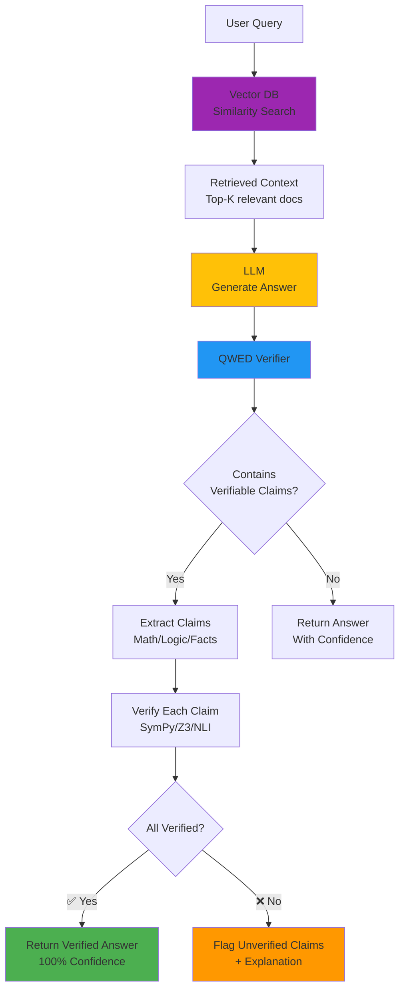

# Capstone Project: Production RAG Chatbot with Verification

**Build a complete, production-ready customer support chatbot**

---

## 🎯 Project Goal

Create a **verified RAG chatbot** that students can add to their portfolio and show to employers.

**What you'll build:**
- RAG pipeline (LangChain + vector database)
- QWED verification for all factual claims
- PII masking for GDPR compliance  
- Error handling + audit logging
- Deployment-ready FastAPI backend

**Estimated Time:** 90 minutes

---

## Architecture Overview

**How RAG + QWED works together:**



---

## 📋 Requirements Checklist

Your chatbot must have:

- [ ] Vector database (Chroma or Pinecone)
- [ ] LangChain RAG pipeline
- [ ] QWED verification on retrievals
- [ ] PII masking (GDPR compliant)
- [ ] Error handling (retry + fallback)
- [ ] Audit logging (compliance trail)
- [ ] FastAPI REST endpoint
- [ ] Documentation (README with screenshots)

---

## 🏗️ Project Structure

```
capstone-project/
├── README.md (you're here)
├── starter-code/
│   ├── app.py (FastAPI skeleton)
│   ├── rag_pipeline.py (TODO: implement)
│   ├── verification.py (TODO: implement)
│   └── requirements.txt
├── solution/
│   ├── app.py (complete implementation)
│   ├── rag_pipeline.py
│   ├── verification.py
│   └── README.md
└── CHECKLIST.md (completion criteria)
```

---

## 🚀 Getting Started

### Step 1: Understand the Use Case

**Scenario:** You're building AI support for "TechStore" - an electronics retailer.

**Requirements:**
- Answer questions about products (prices, specs, availability)
- Verify all prices before showing to customers
- Mask customer PII (names, emails, phone numbers)
- Log all interactions for compliance

### Step 2: Set Up Your Environment

```bash
cd capstone-project/starter-code

# Create virtual environment
python -m venv venv
source venv/bin/activate  # On Windows: venv\Scripts\activate

# Install dependencies
pip install -r requirements.txt
```

### Step 3: Choose Your Path

**Option A: Build from scratch** (recommended for learning)
1. Start with `starter-code/`
2. Follow the implementation guide below
3. Check your work against `solution/`

**Option B: Study the solution** (if short on time)
1. Review `solution/`
2. Understand each component
3. Modify it for a different use case

---

## 📚 Implementation Guide

### Part 1: RAG Pipeline (30 mins)

**File:** `rag_pipeline.py`

**Tasks:**
1. Load product catalog into vector DB
2. Implement semantic search
3. Add context to LLM prompts

**Hints:**
```python
from langchain.vectorstores import Chroma
from langchain.embeddings import Open AIEmbeddings

# TODO: Load your product data
# TODO: Create vector store
# TODO: Implement retrieval
```

**Test:** Query should return relevant products

---

### Part 2: QWED Verification (20 mins)

**File:** `verification.py`

**Tasks:**
1. Extract prices from LLM responses
2. Verify against database
3. Block if verification fails

**Hints:**
```python
from qwed_sdk import QWEDLocal

# TODO: Verify price matches retrieved data
# TODO: Check calculation logic
# TODO: Return confidence score
```

**Test:** Wrong prices should be caught

---

### Part 3: PII Masking (15 mins)

**Tasks:**
1. Enable PII detection
2. Mask before sending to LLM
3. Log masked entities

**Hints:**
```python
client = QWEDLocal(
    mask_pii=True,
    pii_entities=["PERSON", "EMAIL", "PHONE_NUMBER"]
)
```

**Test:** Customer PII shouldn't reach LLM

---

### Part 4: Production Patterns (25 mins)

**Tasks:**
1. Add retry logic with exponential backoff
2. Implement fallback responses
3. Create audit log
4. Add health check endpoint

**Test:** System should handle failures gracefully

---

## ✅ Completion Checklist

**Before submitting, verify:**

### Functionality
- [ ] Chatbot answers product questions accurately
- [ ] Prices are verified against database
- [ ] Wrong prices are rejected
- [ ] PII is masked in logs

### Production Readiness
- [ ] Retry logic works (test by breaking connection)
- [ ] Fallback responses shown when verification fails
- [ ] All interactions logged to file
- [ ] API has health check endpoint (`/health`)

### Documentation
- [ ] README explains how to run
- [ ] Screenshots of chatbot in action
- [ ] Architecture diagram (optional)

### Deployment
- [ ] `requirements.txt` is complete
- [ ] Environment variables documented
- [ ] Docker file provided (bonus!)

---

## 🎓 Learning Outcomes

After completing this project, you'll be able to:

✅ Build production RAG pipelines  
✅ Integrate QWED verification  
✅ Handle GDPR/PII compliance  
✅ Deploy verified AI systems  
✅ Show employers a complete portfolio piece

---

## 📊 Grading Rubric (Self-Assessment)

| Criteria | Points | Your Score |
|----------|--------|------------|
| RAG pipeline works | 20 | ___ |
| Verification implemented | 25 | ___ |
| PII masking enabled | 15 | ___ |
| Error handling | 15 | ___ |
| Audit logging | 10 | ___ |
| API endpoints | 10 | ___ |
| Documentation | 5 | ___ |
| **Total** | **100** | ___ |

**90+:** Portfolio-ready 🌟  
**75-89:** Good, needs polish  
**60-74:** Functional, needs work  
**<60:** Review modules 3-4

---

## 🚀 Next Steps

**After completing:**

1. **Deploy it!**
   - Host on Render/Railway/Fly.io
   - Get a live URL

2. **Add to portfolio**
   - GitHub README with demo
   - LinkedIn post
   - Resume bullet point

3. **Extend it**
   - Add more verification engines
   - Multi-language support
   - Analytics dashboard

---

## 💬 Get Help

**Stuck?** Ask in [GitHub Discussions](https://github.com/QWED-AI/qwed-learning/discussions)

**Show your work!** Share your implementation in `#show-your-projects`

---

**Ready? Let's build!** 🛠️

→ [Start with starter-code/](starter-code/)
