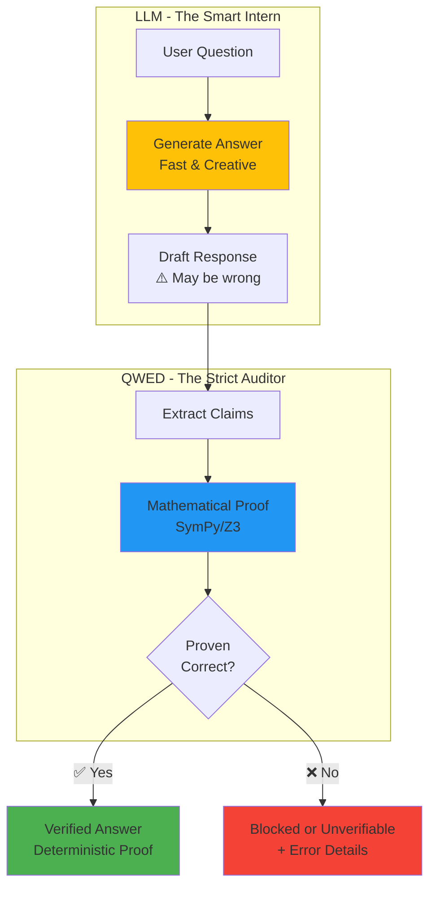

# What Are Formal Methods? (For Developers)

**Duration:** 10 minutes  
**Goal:** Understand verification basics without the academic jargon

---

## The Core Idea (In Plain English)

**Formal verification** means **mathematically proving** something is correct — not just testing it.

Think of it like this:

| Regular Testing | Formal Verification |
|----------------|---------------------|
| "We tested 1000 cases, looks good!" | "Mathematically proven for ALL cases" |
| Sample-based confidence | Mathematical guarantee |
| Can miss edge cases | Covers every possibility |

**Example:**

```python
# Testing approach
assert calculate_tax(100) == 15  # ✅ Works for this case
assert calculate_tax(200) == 30  # ✅ Works for this case
# But what about negative numbers? Floats? Edge cases?

# Formal verification approach  
# Proves: "For ALL inputs x, tax = x * 0.15"
# Guaranteed to work for ANY input (within domain)
```

---

## Formal Methods ≠ Heavy Mathematics

**Common Fear:**
> "Formal verification = complex math and theorem provers"

**Reality:**
Formal methods in practice often use **structured rules, constraints, and deterministic checks** — not academic proofs.

**QWED focuses on practical verification:**
- ✅ SymPy for math (symbolic engine, not a theorem prover)
- ✅ Z3 for logic (constraint solver, not first-order logic)
- ✅ AST for code (syntax checking, not program proofs)

**You don't need a PhD in math.** You need to understand: "Can this be proven deterministically?"

---

## Mental Model: The Intern & The Auditor

**Think of LLMs as:**
🧑‍💼 **A very smart intern**
- Creative, fast, helpful
- But makes mistakes on details
- Sometimes confidently wrong

**Think of QWED as:**
👔 **A strict auditor**
- Checks every answer
- Never assumes, always verifies
- Only approves what's mathematically proven

**The workflow:**
```
Intern (LLM) writes answer → Auditor (QWED) checks proof → User gets verified result
```

**Visual Model:**



---

## What QWED Is (And Isn't)

### ✅ **QWED IS:**
- A **deterministic verification layer** for LLM outputs
- An **untrusted translator** pattern (LLM converts English → Math, QWED verifies Math)
- A way to **make hallucinations irrelevant** (not fix them)
- **Engineering correctness** for production AI

### ❌ **QWED IS NOT:**
- ❌ A prompt trick or prompt engineering tool
- ❌ A red teaming / adversarial testing tool
- ❌ Content moderation or safety filtering
- ❌ A way to "make LLMs smarter"

**It makes them safer and predictable.**

---

## The Key Difference: Judge vs Solver

Most AI safety tools use **LLM-as-Judge**:
```
GPT-3.5 answers → GPT-4 checks → Still probabilistic!
```
**Problem:** Both trained on same data. Shared blind spots.

**QWED uses Solver-as-Judge:**
```
LLM translates → SymPy/Z3 proves → Deterministic guarantee ✅
```
**Solution:** Math engine doesn't have "opinions" — only facts.

---

## QWED = Query With Evidence & Determinism

The acronym tells the story:

- **Q**uery: User asks in natural language
- **W**ith **E**vidence: LLM provides reasoning (untrusted)
- **D**eterminism: Symbolic engine verifies the answer

**Example:**
```python
User: "What is 15% of $200?"
├─ LLM: "Let me calculate: 200 * 0.15 = 30"  (evidence)
├─ QWED: Verifies "200 * 0.15" with SymPy
└─ Result: $30 ✅ (proven, not guessed)
```

---

## Why This Matters for Production

Without verification:
- 73% accuracy on finance tasks (Claude Opus benchmark)
- Bugs slip into production
- Users lose trust

With verification:
- Deterministic checks on supported tasks (math, logic, code syntax)
- Errors caught before deployment
- Stronger trust boundaries for critical workflows

**Not all tasks are verifiable** (creative writing isn't), but for **critical outputs** (money, medical, legal), verification is non-negotiable.

If a task cannot be verified, QWED should surface a non-pass state such as `UNVERIFIABLE` or `HUMAN_REVIEW_REQUIRED`, not a weaker confidence score.

---

## Quick Check: Did You Get It?

**Answer these to test yourself:**

1. **What's the difference between testing and formal verification?**
   <details>
   <summary>Answer</summary>
   Testing checks sample cases. Verification proves correctness for ALL cases mathematically.
   </details>

2. **Why can't you use GPT-4 to verify GPT-3.5?**
   <details>
   <summary>Answer</summary>
   Both are probabilistic and trained on similar data. They share blind spots. You need a deterministic judge (like SymPy).
   </details>

3. **What does QWED stand for?**
   <details>
   <summary>Answer</summary>
   Query With Evidence & Determinism
   </details>

4. **Is QWED a prompt engineering tool?**
   <details>
   <summary>Answer</summary>
   No. It's a deterministic verification layer. Completely different approach.
   </details>

---

## Key Takeaways

✅ **Formal verification = mathematical proofs, not sample testing**  
✅ **You don't need heavy math** — QWED uses practical symbolic engines  
✅ **LLMs are untrusted translators** — QWED is the deterministic judge  
✅ **Goal: Make hallucinations irrelevant**, not fix them  
✅ **This is engineering correctness**, not AI safety activism

**Next:** Learn why LLM hallucinations are inevitable →

[Continue to Module 0: Prerequisites](README.md)

---

**Questions?** Ask in [GitHub Discussions](https://github.com/QWED-AI/qwed-learning/discussions)
