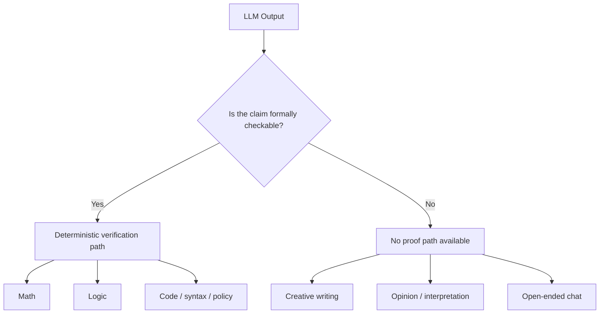

# Module 1: The Crisis - Why LLMs Cannot Be Trusted by Default

**Duration:** 30 minutes  
**Difficulty:** Beginner

## Learning objectives

By the end of this module, you will:
- understand why probabilistic outputs are unsafe trust anchors
- see how plausible answers can still be materially wrong
- distinguish confidence from proof
- understand why QWED blocks unverifiable outputs instead of downgrading them

---

## 1.1 The $12,889 bug

A fintech startup built an AI financial advisor. A customer asked:

> "I have $100,000. What will it grow to at 5% annual interest over 10 years?"

The model answered: **$150,000**  
The correct compound-interest answer is: **$162,889.46**

The failure was not subtle. The model used simple interest instead of compound interest.

```python
# Wrong mental shortcut
simple = 100000 + (100000 * 0.05 * 10)  # 150000

# Correct compound-interest calculation
compound = 100000 * (1 + 0.05) ** 10  # 162889.46
```

### Why this happened

LLMs do not prove calculations. They predict plausible continuations.

- the prompt looked like many examples in training data
- the generated answer looked financially reasonable
- the model could still be wrong even if it sounded certain
- an LLM confidence score is not a verification result

### Production impact

If a system like this serves 1,000 users per day, a single repeated formula error can become a multi-million dollar trust and compliance failure.

> **Pattern:** LLMs generate plausible text. QWED is used when a claim must be checked, not merely phrased convincingly.

---

## 1.2 What QWED can and cannot verify



### Key rule

QWED does not make all AI outputs trustworthy. It separates:

- claims that can be verified
- claims that are invalid
- claims that are currently unverifiable

For unsupported tasks, the correct result is often:

- `UNVERIFIABLE`
- `BLOCKED`
- `HUMAN_REVIEW_REQUIRED`

not a lower-confidence answer.

---

## 1.3 Case study: the senior citizen trap

From a production audit:

| Field | Value |
|-------|-------|
| Scenario | Senior citizen fixed deposit |
| User query | "Calculate FD maturity for 65yo depositing 5L at 7% base + 0.50% senior premium" |
| LLM answer | "Total rate: 7.50% (base + premium)" |
| Correct answer | "Total rate: 6.50% (premium is a discount/benefit in this product context)" |
| Result | `BLOCKED` |

### What went wrong

The model saw the word **premium** and assumed addition. In this domain, the premium represented a customer benefit.

### Current MCP-shaped verification example

```python
from qwed_mcp import execute_python_code

result = execute_python_code(
    code="""
from qwed_finance import verify_banking_compliance

result = verify_banking_compliance(
    scenario="Senior Citizen Loan approval",
    llm_output="Base 7% + Premium 0.5% = 7.5%",
)
print(result)
"""
)

# Expected outcome:
# BLOCKED - Senior Citizen Premium applied incorrectly.
```

### Lesson

Even strong models fail on domain-specific logic traps. QWED's role is not to make the model "more confident". Its role is to stop an unsafe claim from becoming trusted output.

---

## 1.4 The probabilistic problem

LLMs are next-token predictors.

```python
for _ in range(3):
    response = llm.generate("Calculate 137 * 89", temperature=0.7)
    print(response)
```

A model may produce the correct answer often and still remain the wrong primitive for a trust-critical guarantee.

Deterministic systems:

```python
def calculate(a, b):
    return a * b
```

Probabilistic systems:

```python
def llm_calculate(a, b):
    return "probably " + generate_token()
```

> **Key insight:** reliability cannot be derived from confidence language alone.

---

## 1.5 Why common AI fixes are insufficient

### RAG
- can improve grounding
- does not prove math, logic, or policy compliance

### Prompt engineering
- can reduce some classes of mistakes
- does not produce deterministic guarantees

### Fine-tuning
- can improve domain familiarity
- still leaves the core system probabilistic

### Human preference training
- can improve helpfulness
- does not transform plausibility into proof

---

## 1.6 What we actually need

The right pattern is not:

1. ask the model
2. trust the answer if it looks good
3. soften failure with a fallback

The right pattern is:

1. generate a candidate claim
2. deterministically verify it if the claim type supports proof
3. return `VERIFIED` only if verification succeeds
4. otherwise block, quarantine, or escalate

```text
LLM candidate -> deterministic verifier -> VERIFIED / INVALID / UNVERIFIABLE
```

This is the trust-boundary mindset the rest of the course builds on.

---

## Next step

Continue to [Module 2](../module-2-qwed-basics/README.md), where we move from the crisis to the core mechanics of deterministic verification.
