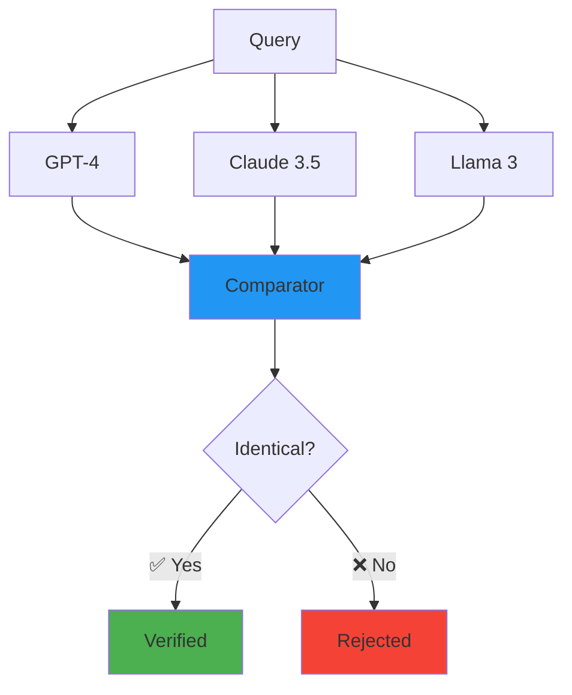

# Module 10: Advanced Patterns - RAG & Consensus

> **"One witness is a rumor. Two witnesses are evidence. Three witnesses are a fact."**

⏱️ **Duration:** 45 minutes  
📊 **Level:** Expert  
🎯 **Goal:** Master the final two QWED engines: **Fact Checker** (RAG) and **Consensus** (Multi-Model).

---

## 🧠 What You'll Learn

After this module, you'll understand:

- ✅ **The Fact Guard:** Verifying RAG citations using NLI (Natural Language Inference)
- ✅ **The Consensus Pattern:** Using Multi-Model Agreement for critical decisions
- ✅ **Deterministic Consensus:** Why robust agreement is a "switch," not a probability

---

## 📚 Table of Contents

| Lesson | Topic | Time |
|--------|-------|------|
| 10.1 | [The Fact Guard (RAG)](#101-the-fact-guard-rag) | 20 min |
| 10.2 | [The Consensus Engine](#102-the-consensus-engine) | 25 min |

---

## 10.1: The Fact Guard (RAG)

### The Problem: Hallucinated Citations

RAG (Retrieval Augmented Generation) gives the LLM the right data, but **the LLM can still ignore it**.

```
Context: "QWED v1.0 was released in 2024."
User: "When was QWED released?"
LLM: "QWED was released in 2022." (Hallucination)
```

### The Solution: Fact Checker Engine (TF-IDF + NLI)

QWED's Fact Checker uses **Natural Language Inference (NLI)** to verify if the Generated Answer is **entailed by** the Retrieved Context.

```python
from qwed_sdk import QWEDLocal

client = QWEDLocal()

context = "QWED v1.0 was released in 2024."
answer = "QWED was released in 2022."

result = client.verify_fact(
    claim=answer,
    context=context
)

if not result.verified:
    print(f"🚫 Hallucination Detected: {result.reason}")
    # Reason: "Contradiction found. Claim says 2022, Context says 2024."
```

### Enterprise Use Case: Citation Verification

In legal or medical RAG, every claim must have a valid citation.

```python
def verify_citations(answer, sources):
    for sentence in answer.split("."):
        # Verify each sentence against the provided sources
        verification = client.verify_fact(claim=sentence, context=sources)
        if not verification.verified:
            flag_sentence(sentence)
```

---

## 10.2: The Consensus Engine

### The Problem: Ambiguity

Some questions don't have a single "math" answer.
*   "Is this email phishing?"
*   "Is this content hate speech?"
*   "Is this financial advice compliant?"

For these, **one model's opinion is just a guess.**

### The Solution: The Council of Verifiers

We query **Multiple Models** (e.g., GPT-4, Claude 3.5, Llama 3) and demand **Consensus**.



### Code Implementation

```python
from qwed_sdk import ConsensusEngine

verifier = ConsensusEngine(
    models=["gpt-4", "claude-3-5-sonnet", "llama-3-70b"],
    threshold="unanimous"  # All must agree
)

result = verifier.verify_content(
    "Is this transaction suspicious: Transfer $9,999 to 'Cash App'?",
    policy="Block structuring attempts"
)

if result.verified:
    print("✅ Consensus Reached: Suspicious")
else:
    print("⚠️ Disagreement: Human Review Needed")
```

### The "Deterministic" Question

**"Wait, isn't this probabilistic?"**

**NO.** Here is why QWED Consensus is **Deterministic**:

#### ❌ What We Are NOT Doing (Probabilistic)
```python
# This is NOT QWED.
grade = gpt4.ask("Rate accuracy 0.0 to 1.0")
if grade > 0.8: return True  # Arbitrary threshold
```

#### ✅ What We ARE Doing (Deterministic)
```python
# This IS QWED.
response_a = gpt4.ask(query)
response_b = claude.ask(query)

# The Comparator is a deterministic switch.
# It acts as a LOGICAL AND gate.
is_identical = qwed.engines.consensus.compare(response_a, response_b)

if is_identical:
    return True
else:
    return False # We reject disgreement 100% of the time.
```

**The "Double-Key" Analogy:**
In a nuclear silo, two officers must turn keys. The officers are human (probabilistic), but the **switch** is deterministic. QWED is the switch.

### 🎯 Key Takeaway

> **"If the Council disagrees, the answer is wrong. Don't guess."**

---

## 📝 Summary

You have now mastered all **8 Verification Engines**:

1.  **Math** (SymPy)
2.  **Logic** (Z3)
3.  **SQL** (SQLGlot)
4.  **Facts** (Exact Match)
5.  **Code** (AST)
6.  **Image** (Vision)
7.  **Fact Checker** (NLI) - *Module 10*
8.  **Consensus** (Multi-Model) - *Module 10*

---

## 🎓 The Neurosymbolic University: Graduated!

You have completed the full **QWED Enterprise Curriculum**.

**[→ Back to Main Menu](../README.md)**
