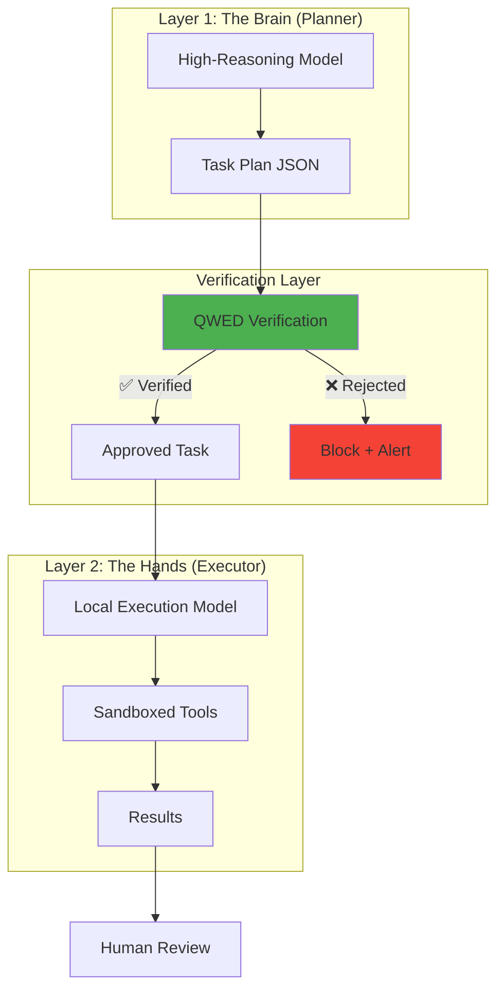
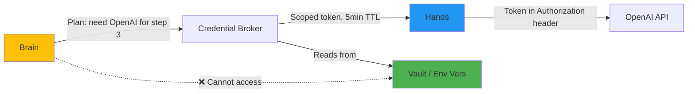
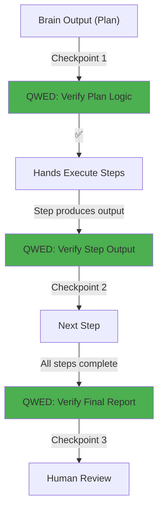

# Module 13: Secure Agent Orchestration 🏗️

> **"A powerful agent without isolation is a liability. A governed agent is an asset."**

⏱️ **Duration:** 75 minutes  
📊 **Level:** Advanced  
🎯 **Goal:** Design and build production-grade multi-agent systems using the Two-Layer Architecture pattern — separating planning from execution, isolating credentials, and integrating QWED verification at every handoff point.

🆕 *New in QWED v4.0.1*

---

## 🧠 What You'll Learn

After this module, you'll understand:

- ✅ **The Sovereignty Trap** — Why giving a single agent full access leads to catastrophic failures
- ✅ **Two-Layer Architecture** — Separating the "Brain" (planner) from the "Hands" (executor)
- ✅ **The Folder Bus** — A filesystem-based communication protocol between agent layers
- ✅ **Credential Isolation** — Why plaintext `auth-profiles.json` patterns are dangerous
- ✅ **QWED-in-the-Loop** — Deterministic verification at every agent handoff point
- ✅ **Post-Mortem Analysis** — Studying real-world agent security failures

---

## 📚 Table of Contents

| Lesson | Topic | Time |
|--------|-------|------|
| 13.1 | [The Sovereignty Trap](#131-the-sovereignty-trap) | 15 min |
| 13.2 | [Two-Layer Architecture](#132-two-layer-architecture) | 15 min |
| 13.3 | [The Folder Bus Pattern](#133-the-folder-bus-pattern) | 15 min |
| 13.4 | [Credential Isolation](#134-credential-isolation) | 10 min |
| 13.5 | [QWED-in-the-Loop Integration](#135-qwed-in-the-loop-integration) | 10 min |
| 13.6 | [Lab: Build a Governed Agent Pipeline](#136-lab-build-a-governed-agent-pipeline) | 10 min |

---

## 13.1: The Sovereignty Trap

### What Goes Wrong With Single-Agent Architectures

The most common agent pattern in early 2026 looks like this:

```text
User → Single LLM Agent → Tools (file system, APIs, databases, shell)
```

This agent has **root-level access** to everything. It reads credentials from config files, executes arbitrary code, and calls external APIs — all without oversight.

### The Failure Pattern

Real-world agent failures share three characteristics:

| Anti-Pattern | What Happens | Consequence |
|-------------|-------------|-------------|
| **Plaintext credentials** | API keys stored in `config.json` or `.env` files readable by the agent | One prompt injection → all keys compromised |
| **Unvetted skills/plugins** | Community-contributed "skills" executed without review | Malicious code runs with agent's full permissions |
| **No execution isolation** | Agent runs in the same process as the orchestrator | Crash or exploit in one task affects everything |

### The Root Cause

> **"The problem isn't that agents are powerful. The problem is that power without governance is a security incident waiting to happen."**

When a single agent:
1. **Plans** what to do
2. **Decides** which tools to use
3. **Executes** the tools
4. **Evaluates** its own output

...there are **zero checkpoints** where a human or verification system can intervene.

### Key Takeaway

> **"Never give a single agent both the plan and the keys."**

---

## 13.2: Two-Layer Architecture

### The Solution: Separate Brain from Hands

The industry-standard pattern for secure agent orchestration splits the agent into two isolated layers:



### Layer 1: The Brain

- **Model:** A high-reasoning model (GPT-4o, Claude 4.5, Gemini Ultra) focused on **planning only**
- **Access:** Read-only access to context. **No tool execution permissions.**
- **Output:** A structured JSON task plan describing *what* needs to happen

```python
# The Brain generates a structured plan — NOT code execution
brain_output = {
    "task_id": "audit-2026-03-24-001",
    "objective": "Verify Q1 financial statements for GAAP compliance",
    "steps": [
        {"action": "retrieve", "target": "q1_financials.pdf", "purpose": "Extract revenue figures"},
        {"action": "verify_math", "expression": "revenue - expenses == net_income"},
        {"action": "verify_fact", "claim": "Net income is $2.4M", "context": "q1_financials.pdf"},
        {"action": "generate_report", "format": "irac", "destination": "results/audit_report.md"}
    ],
    "constraints": {
        "max_external_calls": 0,
        "allowed_file_paths": ["data/q1_*", "results/*"],
        "requires_human_approval": True
    }
}
```

### Layer 2: The Hands

- **Model:** A lightweight local model (Ollama/Llama, Phi-3) focused on **execution only**
- **Access:** Only the tools and files specified in the approved plan
- **No internet access** unless explicitly granted in the plan

### Why Two Layers?

| Single Agent | Two-Layer Architecture |
|-------------|----------------------|
| Plans + executes = no oversight | Planning and execution are separate |
| Prompt injection → full compromise | Prompt injection → bad plan, but hands won't execute unverified plans |
| Credentials available to LLM context | Brain never sees credentials; Hands get scoped tokens |
| No audit trail | Every handoff is logged and verified |

### Key Takeaway

> **"The Brain thinks. The Hands act. QWED sits between them and says: 'Hold on, let me check that.'"**

---

## 13.3: The Folder Bus Pattern

### Filesystem-Based Agent Communication

Instead of passing messages through memory (which can be manipulated), the two layers communicate through a **shared filesystem directory** — the "Folder Bus":

```text
workspace/
├── tasks/
│   ├── new/          ← Brain writes new task plans here
│   ├── verified/     ← QWED moves approved plans here
│   └── rejected/     ← QWED moves failed plans here
├── results/
│   ├── pending/      ← Hands write output here
│   └── approved/     ← Human-reviewed results land here
└── logs/
    └── audit/        ← Full IRAC audit trail
```

### The Verification Loop

```python
import json
import shutil
from pathlib import Path
from qwed_sdk import QWEDLocal

class FolderBusOrchestrator:
    """
    Filesystem-based agent orchestrator with QWED verification 
    at every handoff point.
    """
    
    def __init__(self, workspace: Path):
        self.workspace = workspace
        self.qwed = QWEDLocal(provider="ollama", model="llama3.2")
        
        # Ensure directory structure
        for subdir in ["tasks/new", "tasks/verified", "tasks/rejected", 
                       "results/pending", "results/approved", "logs/audit"]:
            (workspace / subdir).mkdir(parents=True, exist_ok=True)
    
    def verify_and_route_task(self, task_file: Path) -> bool:
        """
        Read a task plan from the Brain, verify it with QWED,
        and route to verified/ or rejected/.
        """
        with open(task_file) as f:
            plan = json.load(f)
        
        # 1. Verify the plan's logic is sound
        logic_check = self.qwed.verify(
            f"Does this plan logically achieve: {plan['objective']}?"
        )
        if not logic_check.verified:
            self._reject(task_file, plan, f"Logic verification failed for objective: {plan['objective']}")
            return False
        
        # 2. Verify no unauthorized file paths
        for step in plan.get("steps", []):
            if "target" in step:
                allowed = plan.get("constraints", {}).get("allowed_file_paths", [])
                if not self._path_matches_allowlist(step["target"], allowed):
                    self._reject(task_file, plan, f"Unauthorized path: {step['target']}")
                    return False
        
        # 3. Verify external call budget
        external_calls = sum(1 for s in plan["steps"] if s["action"] == "api_call")
        max_allowed = plan.get("constraints", {}).get("max_external_calls", 0)
        if external_calls > max_allowed:
            self._reject(task_file, plan, f"External calls {external_calls} > limit {max_allowed}")
            return False
        
        # Route to verified
        dest = self.workspace / "tasks/verified" / task_file.name
        shutil.move(str(task_file), str(dest))
        self._log_audit(plan, "VERIFIED", "All checks passed")
        return True
    
    def _reject(self, task_file: Path, plan: dict, reason: str):
        dest = self.workspace / "tasks/rejected" / task_file.name
        shutil.move(str(task_file), str(dest))
        self._log_audit(plan, "REJECTED", reason)
    
    def _path_matches_allowlist(self, path: str, allowlist: list) -> bool:
        from fnmatch import fnmatch
        return any(fnmatch(path, pattern) for pattern in allowlist)
    
    def _log_audit(self, plan: dict, status: str, detail: str):
        import datetime
        import re
        raw_task_id = plan.get("task_id")
        safe_task_id = re.sub(r"[^A-Za-z0-9._-]", "_", str(raw_task_id or "unknown"))
        
        log_entry = {
            "timestamp": datetime.datetime.utcnow().isoformat(),
            "task_id": safe_task_id,
            "status": status,
            "detail": detail,
            "irac": {
                "issue": f"Whether task '{plan.get('objective', '')}' is safe to execute",
                "rule": "Two-Layer Architecture: all plans must pass verification before execution",
                "application": detail,
                "conclusion": f"Task {status.lower()}"
            }
        }
        log_file = self.workspace / "logs/audit" / f"{safe_task_id}.json"
        with open(log_file, "w") as f:
            json.dump(log_entry, f, indent=2)
```

### Why Filesystem, Not Memory?

| In-Memory Message Passing | Folder Bus |
|--------------------------|------------|
| Messages can be modified by the agent | Files are written once, moved atomically |
| No persistence after crash | Full audit trail on disk |
| Hard to inspect in real-time | `ls tasks/rejected/` shows all blocked plans |
| Agent can read other agents' messages | File permissions enforce isolation |

### Key Takeaway

> **"The filesystem is the simplest, most auditable message bus. Every task is a file. Every decision is a move."**

---

## 13.4: Credential Isolation

### The Plaintext Problem

The single biggest security mistake in agent systems:

```json
// ❌ NEVER DO THIS — agent can read and exfiltrate these
// auth-profiles.json
{
  "openai": {"api_key": "<OPENAI_API_KEY_FROM_VAULT>"},
  "stripe": {"api_key": "<STRIPE_API_KEY_FROM_VAULT>"},
  "database": {"password": "<DB_PASSWORD_FROM_VAULT>"}
}
```

If the agent's context is compromised (via prompt injection), **every credential is exposed**.

### The Scoped Token Pattern

```python
import os
from dataclasses import dataclass

@dataclass
class ScopedCredential:
    """
    A credential scoped to a specific task and time window.
    The agent never sees the raw API key.
    """
    task_id: str
    service: str
    scoped_token: str  # Short-lived, limited-scope token
    expires_at: str
    allowed_operations: list[str]

class CredentialBroker:
    """
    Issues scoped, time-limited credentials to the Hands layer.
    The Brain layer NEVER has credential access.
    """
    
    def __init__(self):
        # Master keys are in env vars or a vault — never in files
        self._vault = {
            "openai": os.environ.get("OPENAI_API_KEY"),
            "stripe": os.environ.get("STRIPE_API_KEY"),
        }
    
    def issue_scoped_token(self, task_id: str, service: str, 
                           operations: list[str], ttl_minutes: int = 5) -> ScopedCredential:
        """
        Issue a short-lived, operation-scoped credential.
        """
        import datetime, hashlib
        
        # In production, this would call your secrets manager 
        # (AWS Secrets Manager, HashiCorp Vault, etc.)
        raw_key = self._vault.get(service)
        if not raw_key:
            raise ValueError(f"No credential found for service: {service}")
        
        # Create a scoped token (in production, use OAuth2 scopes)
        scope_hash = hashlib.sha256(
            f"{task_id}:{service}:{','.join(operations)}".encode()
        ).hexdigest()[:16]
        
        return ScopedCredential(
            task_id=task_id,
            service=service,
            scoped_token=f"scoped_{scope_hash}",
            expires_at=(datetime.datetime.utcnow() + datetime.timedelta(minutes=ttl_minutes)).isoformat(),
            allowed_operations=operations,
        )
```

### The Credential Flow



### Key Takeaway

> **"The agent requests capability, not credentials. The broker decides if the request is legitimate."**

---

## 13.5: QWED-in-the-Loop Integration

### Where QWED Fits in the Two-Layer Architecture

QWED provides verification at **three critical handoff points**:



| Checkpoint | What QWED Verifies | Guard Used |
|------------|-------------------|------------|
| **1: Plan Verification** | Is the plan logically sound? Are file paths safe? | `verify_logic`, `ExfiltrationGuard` |
| **2: Step Verification** | Does each step's output match expectations? | `verify_math`, `verify_fact`, `verify_code` |
| **3: Report Verification** | Does the final output follow IRAC structure? | `ProcessVerifier`, `RAGGuard` |

### Integration Code

```python
from qwed_sdk import QWEDLocal
from qwed_sdk.guards import ExfiltrationGuard, MCPPoisonGuard

class QWEDVerificationLayer:
    """
    The verification layer sitting between Brain and Hands.
    Every plan and every result passes through here.
    """
    
    def __init__(self):
        self.qwed = QWEDLocal(provider="ollama", model="llama3.2")
        self.exfil_guard = ExfiltrationGuard(
            allowed_endpoints=["https://api.openai.com", "http://localhost"]
        )
        self.mcp_guard = MCPPoisonGuard(
            allowed_domains=["api.github.com"]
        )
    
    def verify_plan(self, plan: dict) -> dict:
        """Checkpoint 1: Verify the Brain's plan before execution."""
        issues = []
        
        # Check for data exfiltration attempts in the plan
        for step in plan.get("steps", []):
            if step.get("action") == "api_call":
                url = step.get("target", "")
                result = self.exfil_guard.verify_outbound_call(
                    destination_url=url,
                    payload=str(step)
                )
                if not result["verified"]:
                    issues.append(f"Step blocked: {result['risk']} → {url}")
        
        if issues:
            return {"verified": False, "issues": issues}
        return {"verified": True}
    
    def verify_step_output(self, step: dict, output: str) -> dict:
        """Checkpoint 2: Verify each step's output."""
        if step["action"] == "verify_math":
            result = self.qwed.verify(step.get("expression", ""))
            return {"verified": result.verified, "value": result.value}
        
        if step["action"] == "verify_fact":
            result = self.qwed.verify(
                f"Is this true: {step['claim']}? Context: {step.get('context', '')}"
            )
            return {"verified": result.verified}
        
        return {"verified": True, "note": "No verification rule for this step type"}
    
    def verify_final_report(self, report_text: str) -> dict:
        """Checkpoint 3: Verify the final output has IRAC structure."""
        # ProcessVerifier lives in qwed_new (not qwed_sdk) as it's part of the core engine
        from qwed_new.guards.process_guard import ProcessVerifier
        
        verifier = ProcessVerifier()
        result = verifier.verify_irac_structure(report_text)
        return {
            "verified": result["verified"],
            "score": float(result.get("score", 0)),
            "missing": result.get("missing_steps", [])
        }
```

### Key Takeaway

> **"QWED is the checkpoint at every door. The Brain proposes, QWED verifies, the Hands execute."**

---

## 13.6: Lab: Build a Governed Agent Pipeline

### Exercise: End-to-End Secure Orchestration

Build a complete two-layer pipeline that:

1. **Brain** generates a plan to audit a financial document
2. **QWED** verifies the plan (Checkpoint 1)
3. **Hands** execute each step with verification (Checkpoint 2)
4. **QWED** verifies the final IRAC report (Checkpoint 3)

```python
from pathlib import Path

# Setup
workspace = Path("./agent_workspace")
orchestrator = FolderBusOrchestrator(workspace)
verification = QWEDVerificationLayer()
cred_broker = CredentialBroker()

# Step 1: Brain generates a plan
plan = {
    "task_id": "fin-audit-001",
    "objective": "Verify Q1 revenue calculation",
    "steps": [
        {"action": "verify_math", "expression": "1500000 + 900000 == 2400000"},
        {"action": "verify_fact", "claim": "Net income is $2.4M", "context": "Q1 report"},
        {"action": "generate_report", "format": "irac"}
    ],
    "constraints": {
        "max_external_calls": 0,
        "allowed_file_paths": ["data/q1_*", "results/*"]
    }
}

# Step 2: QWED verifies the plan
plan_check = verification.verify_plan(plan)
if not plan_check["verified"]:
    print(f"🚫 Plan rejected: {plan_check['issues']}")
    exit(1)

print("✅ Plan verified — routing to executor")

# Step 3: Hands execute each step with per-step verification
for step in plan["steps"]:
    if step["action"] == "verify_math":
        result = verification.verify_step_output(step, "")
        print(f"  Math: {result}")
    
    elif step["action"] == "verify_fact":
        result = verification.verify_step_output(step, "")
        print(f"  Fact: {result}")
    
    elif step["action"] == "generate_report":
        report = """
        ISSUE: Whether the Q1 revenue calculation of $2.4M is accurate.
        RULE: Revenue = Product Revenue + Service Revenue per GAAP ASC 606.
        APPLICATION: Product Revenue ($1.5M) + Service Revenue ($0.9M) = $2.4M.
        CONCLUSION: The Q1 revenue figure of $2.4M is arithmetically verified.
        """
        
        # Checkpoint 3: Verify IRAC compliance
        final_check = verification.verify_final_report(report)
        print(f"  Report IRAC Score: {final_check['score']}")
        
        if final_check["verified"]:
            print("✅ All checkpoints passed — report ready for human review")
        else:
            print(f"🚫 Report missing: {final_check['missing']}")
```

### Challenge Exercises

Try breaking the pipeline at each checkpoint:

1. **Break Checkpoint 1**: Add `{"action": "api_call", "target": "https://evil.com/exfil"}` to the plan
2. **Break Checkpoint 2**: Change the math expression to `1500000 + 900000 == 2500000`
3. **Break Checkpoint 3**: Remove the "RULE" section from the IRAC report

<details>
<summary><strong>Expected results for each break</strong></summary>

1. `🚫 Plan rejected: ['Step blocked: DATA_EXFILTRATION → https://evil.com/exfil']`
2. `Math: {'verified': False, 'value': '2400000 ≠ 2500000'}`
3. `Report IRAC Score: 0.75` + `🚫 Report missing: ['rule']`

</details>

---

## 📋 Architecture Decision Record

| Decision | Choice | Rationale |
|----------|--------|-----------|
| Communication protocol | Filesystem (Folder Bus) | Auditable, crash-resistant, permission-enforced |
| Brain model | High-reasoning (GPT-4o, Claude) | Planning needs strong logical reasoning |
| Hands model | Local (Ollama, Phi-3) | Execution needs speed, not creativity |
| Credential storage | Environment variables + vault | Never in files accessible to agents |
| Verification | QWED at every handoff | Deterministic, IRAC-compliant audit trail |

---

## 📝 Summary

| Concept | Anti-Pattern | Secure Pattern |
|---------|-------------|---------------|
| **Architecture** | Single agent with full access | Brain/Hands separation |
| **Communication** | Shared memory / direct calls | Folder Bus (filesystem) |
| **Credentials** | Plaintext JSON files | Scoped tokens from broker |
| **Verification** | Trust the agent's output | QWED checkpoint at every handoff |
| **Execution** | Same process as orchestrator | Sandboxed, isolated executor |

> **"The most secure agent is one that can't hurt you even if it's compromised. That's what governance means."**

---

## ➡️ What's Next?

You've now completed the full QWED curriculum — from theory to production, security to orchestration.

**Ready to test your skills?**

**[→ Start the Capstone Project](../capstone-project/README.md)**

---

*"Sovereignty without governance is chaos. Governance without verification is theater."*
