# Module 2: Neurosymbolic Theory - How Verification Works

**Duration:** 45 minutes  
**Difficulty:** Intermediate

## 🎯 Learning Objectives

By the end of this module, you will:
- Define deterministic systems vs probabilistic systems
- Understand symbolic reasoning engines
- Grasp the "Untrusted Translator" pattern
- Know which verification engine to use when

---

## 🔄 2.1 Determinism 101

### What is Determinism?

**Definition:** A system is deterministic if the same input always produces the exact same output.

### Examples of Deterministic Systems

```python
# ✅ Deterministic
def add(a, b):
    return a + b

add(2, 3)  # Always returns 5
add(2, 3)  # Always returns 5
add(2, 3)  # Always returns 5
```

```python
# ✅ Deterministic (symbolic math)
import sympy as sp
x = sp.Symbol('x')
derivative = sp.diff(x**2, x)
print(derivative)  # Always prints 2*x
```

```python
# ❌ Non-Deterministic
import random
def random_add(a, b):
    noise = random.random()
    return a + b + noise

random_add(2, 3)  # Returns 5.234...
random_add(2, 3)  # Returns 5.891...
random_add(2, 3)  # Returns 5.123...
```

### Why Determinism Matters

**Critical Systems Need It:**
- 🏦 Banking: Same transaction → Same balance
- ✈️ Aviation: Same controls → Same flight path  
- 💊 Healthcare: Same dosage calc → Same result
- ⚖️ Legal: Same contract → Same interpretation

**Benefits:**
1. **Reproducible** - Bugs can be reliably reproduced
2. **Testable** - Unit tests work consistently
3. **Verifiable** - Can prove correctness mathematically
4. **Debuggable** - Step through predictable execution

---

## 🧮 2.2 Symbolic Reasoning

### What is Symbolic AI?

**Symbolic AI** uses explicit rules, logic, and mathematical formulas instead of pattern matching.

### Key Symbolic Engines

#### **SymPy** - Symbolic Mathematics

```python
import sympy as sp

# Define symbolic variables
x, y = sp.symbols('x y')

# Symbolic operations
expr = x**2 + 2*x + 1
factored = sp.factor(expr)
print(factored)  # (x + 1)**2

# Calculus
derivative = sp.diff(x**3, x)
print(derivative)  # 3*x**2

# Solving equations
solution = sp.solve(x**2 - 4, x)
print(solution)  # [-2, 2]
```

**Use Cases:** Math verification, calculus, algebra, equations

#### **Z3** - SMT Solver (Satisfiability Modulo Theories)

```python
from z3 import *

# Define variables
x = Int('x')
y = Int('y')

# Create solver
solver = Solver()

# Add constraints
solver.add(x + y == 10)
solver.add(x > y)

# Check satisfiability
if solver.check() == sat:
    model = solver.model()
    print(f"x = {model[x]}, y = {model[y]}")
    # Possible output: x = 6, y = 4

# Verify logical statements
p, q = Bools('p q')
formula = Implies(And(p, q), p)  # If (p AND q), then p
solver = Solver()
solver.add(Not(formula))  # Try to find counterexample
print(solver.check())  # unsat (no counterexample = proven true)
```

**Use Cases:** Logic verification, constraint solving, proof checking

#### **AST** - Abstract Syntax Trees

```python
import ast

# Parse dangerous code
code = "eval(user_input)"
tree = ast.parse(code)

# Check for dangerous patterns
class DangerDetector(ast.NodeVisitor):
    def visit_Call(self, node):
        if isinstance(node.func, ast.Name):
            if node.func.id in ['eval', 'exec', '__import__']:
                print(f"DANGER: Found {node.func.id}()")
        self.generic_visit(node)

detector = DangerDetector()
detector.visit(tree)  # Output: DANGER: Found eval()
```

**Use Cases:** Code security, static analysis, vulnerability detection

---

## 🎭 2.3 The "Untrusted Translator" Pattern

### The Core Concept

**Don't trust LLMs to compute. Trust them only to translate.**

### Architecture

```
User Question (Natural Language)
    ↓
┌────────────────────────┐
│ LLM (Translator)       │  ← Probabilistic, might make mistakes
│ "Translate to DSL"     │
└───────────┬────────────┘
            │ Unverified DSL
            ▼
┌────────────────────────┐
│ Symbolic Engine (Judge)│  ← Deterministic, mathematical proof
│ SymPy / Z3 / AST       │
└───────────┬────────────┘
            │
       ┌────┴────┐
       ▼         ▼
    ❌ Error   ✅ Proof
```

### Example Flow

**User Query:** "What is the derivative of x²?"

**Step 1: LLM Translation**
```python
# LLM converts natural language → SymPy DSL
llm_output = "sp.diff(x**2, x)"
```

**Step 2: Symbolic Verification**
```python
# SymPy executes (deterministically)
import sympy as sp
x = sp.Symbol('x')
result = sp.diff(x**2, x)
# Result: 2*x (PROVEN mathematically)
```

**Step 3: QWED's Role**
- LLM might translate to wrong DSL → QWED catches it
- LLM might hallucinate result → QWED proves correct answer
- Even if LLM is 100% wrong, symbolic engine gives truth

**The QWED approach:** LLM = Translator, Symbolic Engine = Judge

**Untrusted Translator Workflow:**

```mermaid
graph LR
    A[User Query<br/>English] --> B[LLM Translator<br/>⚠️ Untrusted]
    B --> C[Domain-Specific Language<br/>SymPy/Z3/AST]
    C --> D[Symbolic Engine<br/>✅ Trusted Judge]
    D --> E{Proof<br/>Valid?}
    E -->|Yes| F[Return Verified Result<br/>100% Confidence]
    E -->|No| G[Return Error<br/>+ Explanation]
    
    style B fill:#ffc107
    style D fill:#2196f3
    style F fill:#4caf50
    style G fill:#f44336
    
    classDef dashed stroke-dasharray: 5 5
    class B dashed
```



**Key Point:** We never trust the LLM to compute. We only trust it to translate human language into something a deterministic engine can verify.

**Example:**
- User: "What's 15% of $200?"
- LLM translates to: `0.15 * 200`
- SymPy computes: `30`
- Result: $30 ✅ (proven by SymPy, not guessed by LLM)

---

## 🔍 2.4 Verification vs Detection

### The Crucial Difference

| Approach | How It Works | Guarantee | Cost |
|----------|--------------|-----------|------|
| **Hallucination Detection** | Another LLM checks first LLM | ❌ No | $$ |
| **RAG Grounding** | Vector similarity to docs | ⚠️ Partial | $ |
| **Verification** | Mathematical proof | ✅ Yes | $ |

### Why "LLM as Judge" Fails

```python
# Bad approach:
llm_answer = llm.generate("2+2=?")  # Might say "5"
judge = llm.verify(llm_answer)       # Might also say "correct"
# Both LLMs can be wrong!
```

### Why Verification Works

```python
# Good approach:
llm_answer = llm.generate("2+2=?")   # Says "5"
symbolic_result = 2 + 2              # Computes "4"
verified = (llm_answer == symbolic_result)  # False!
# Math doesn't lie!
```

---

## 🛠️ 2.5 The 8 Verification Engines

QWED routes queries to specialized symbolic engines:

### **Engine 1: Math Verifier** 🧮

**Tech:** SymPy + NumPy  
**Use For:**
- Calculus (derivatives, integrals)
- Algebra (solving equations)
- Finance (compound interest, NPV)
- Statistics (mean, std dev)

**Example:**
```python
result = client.verify_math("Integrate x^2 from 0 to 1")
# SymPy proves: 1/3
```

---

### **Engine 2: Logic Verifier** ⚖️

**Tech:** Z3 SMT Solver  
**Use For:**
- Propositional logic (AND, OR, NOT)
- First-order logic (forall, exists)
- Constraint satisfaction
- Proof checking

**Example:**
```python
result = client.verify_logic("If all A are B, and x is A, is x B?")
# Z3 proves: True
```

---

### **Engine 3: Code Security** 🛡️

**Tech:** AST + Semgrep patterns  
**Use For:**
- Detecting `eval()`, `exec()`
- Finding SQL injection risks
- Checking for hardcoded secrets
- Identifying dangerous imports

**Example:**
```python
result = client.verify_code("user_input = input(); eval(user_input)")
# AST detects: DANGEROUS - eval() found
```

---

### **Engine 4: SQL Validator** 🗄️

**Tech:** SQLGlot parser  
**Use For:**
- Syntax validation
- Injection prevention
- Schema compliance
- Query optimization

**Example:**
```python
result = client.verify_sql("SELECT * FROM users WHERE id = 1 OR 1=1")
# Detects: SQL injection attempt
```

---

### **Engine 5: Stats Engine** 📊

**Tech:** Pandas + WebAssembly sandbox  
**Use For:**
- Data analysis scripts
- Statistical calculations
- Dataframe operations
- Safe code execution

---

### **Engine 6: Fact Checker** 🔍

**Tech:** TF-IDF + NLI models  
**Use For:**
- Grounding against source docs
- Citation verification
- Factual consistency

---

### **Engine 7: Image Verifier** 👁️

**Tech:** OpenCV + metadata analysis  
**Use For:**
- Image dimensions
- Format validation
- Pixel data integrity
- EXIF metadata

---

### **Engine 8: Consensus** 🤝

**Tech:** Multi-provider cross-check  
**Use For:**
- When symbolic verification isn't possible
- Subjective tasks needing agreement
- Cross-validation of outputs

---

## 🎓 Exercises

### Exercise 1: Identify the Engine

Which QWED engine would you use for these tasks?

1. Verify: "Calculate loan payment: $10K at 5% for 30 years"
2. Verify: "Check if `rm -rf /` is safe to run"
3. Verify: "Is this SQL query valid: SELECT * FROM users"
4. Verify: "If A→B and B→C, does A→C?"

<details>
<summary>Answers</summary>

1. **Math Verifier** - Financial calculation
2. **Code Security** - Dangerous command detection
3. **SQL Validator** - Query syntax check
4. **Logic Verifier** - Logical implication proof
</details>

### Exercise 2: Build a Symbolic Verifier

Write a simple deterministic verifier for addition:

```python
def verify_addition(a, b, llm_answer):
    """
    Verify if LLM's addition is correct.
    Returns (verified: bool, correct_answer: int)
    """
    # Your code here
    pass

# Test it:
print(verify_addition(2, 3, "5"))   # Should: (True, 5)
print(verify_addition(2, 3, "6"))   # Should: (False, 5)
```

<details>
<summary>Solution</summary>

```python
def verify_addition(a, b, llm_answer):
    correct = a + b
    verified = (int(llm_answer) == correct)
    return (verified, correct)
```

**Key Insight:** The `+` operator is deterministic. We trust it, not the LLM!
</details>

### Exercise 3: Translate to DSL

Convert these natural language queries to SymPy DSL:

1. "What is the derivative of sin(x)?"
2. "Solve x^2 - 9 = 0"
3. "Integrate e^x from 0 to 1"

<details>
<summary>Answers</summary>

```python
import sympy as sp
x = sp.Symbol('x')

# 1. Derivative
sp.diff(sp.sin(x), x)  # cos(x)

# 2. Solve equation
sp.solve(x**2 - 9, x)  # [-3, 3]

# 3. Integrate
sp.integrate(sp.exp(x), (x, 0, 1))  # e - 1
```
</details>

---

## 🚀 Next Steps

**Ready to build your first verifier?**

→ **[Module 3: Hands-On](../module-3-hands-on/README.md)**

You'll install QWED, run actual verifications, and build production guardrails!

---

## 📚 Additional Resources

- [SymPy Documentation](https://docs.sympy.org/)
- [Z3 Theorem Prover](https://github.com/Z3Prover/z3)
- [Python AST Module](https://docs.python.org/3/library/ast.html)
- [Neurosymbolic AI Overview](https://en.wikipedia.org/wiki/Neurosymbolic_AI)

---

**Questions?** 💬 [Discuss Module 2](https://github.com/QWED-AI/qwed-learning/discussions)
