# Module 3: Hands-On - Build Your First Verifier

**Duration:** 60 minutes  
**Difficulty:** Intermediate

## 🎯 Learning Objectives

By the end of this module, you will:
- Install and configure QWED
- Run your first verification
- Build a Production Verification
- Handle errors gracefully
- Optimize for performance

---

## Production Verification Pipeline

**How verification works in practice:**

```mermaid
graph TB
    A[User Request] --> B[LLM Response]
    B --> C[QWED Client]
    
    C --> D{Domain?}
    
    D -->|Math| E[client.verify_math<br/>→ SymPy Engine]
    D -->|Logic| F[client.verify_logic<br/>→ Z3 Solver]
    D -->|Code| G[client.verify_code<br/>→ AST Parser]
    
    E --> H{Result}
    F --> H
    G --> H
    
    H -->|✅ Verified| I[Return to User<br/>With Proof]
    H -->|❌ Error| J[Log & Alert<br/>Fallback Value]
    
    style C fill:#2196f3
    style E fill:#4caf50
    style F fill:#9c27b0
    style G fill:#f44336
    style I fill:#4caf50
    style J fill:#ff9800
```



**This is what you'll build in this module!**

---

## ⚙️ 3.1 Installation & Setup

### Prerequisites

**Required:**
- Python 3.10+
- pip or conda

**Optional (for free local LLMs):**
- [Ollama](https://ollama.ai) - for $0 cost verification

### Install QWED

```bash
# Basic installation
pip install qwed

# With PII masking support
pip install 'qwed[pii]'

# With LangChain integration
pip install 'qwed[langchain]'

# Everything
pip install 'qwed[all]'
```

### Configuration Options

QWED supports multiple LLM providers:

#### **Option 1: Ollama (FREE!** 💰)

```bash
# Install Ollama
# Download from: https://ollama.ai

# Pull a model
ollama pull llama3

# Start Ollama server (runs on localhost:11434)
ollama serve
```

```python
from qwed_sdk import QWEDLocal

client = QWEDLocal(
    base_url="http://localhost:11434/v1",
    model="llama3"
)
```

#### **Option 2: OpenAI**

```python
import os
os.environ["OPENAI_API_KEY"] = "sk-..."

from qwed_sdk import QWEDLocal

client = QWEDLocal(
    provider="openai",
    model="gpt-4o-mini"  # Cheapest, fastest
)
```

#### **Option 3: Anthropic**

```python
import os
os.environ["ANTHROPIC_API_KEY"] = "sk-ant-..."

from qwed_sdk import QWEDLocal

client = QWEDLocal(
    provider="anthropic",
    model="claude-3-haiku-20240307"
)
```

---

## 🚀 3.2 Your First Verification

### Notebook: [01-first-verification.ipynb](notebooks/01-first-verification.ipynb)

**Time:** 10 minutes

### Math Verification

```python
from qwed_sdk import QWEDLocal

# Initialize client
client = QWEDLocal(
    base_url="http://localhost:11434/v1",  # Free Ollama
    model="llama3"
)

# Verify a math problem
result = client.verify_math("What is the derivative of x^2?")

print(f"Verified: {result.verified}")      # True
print(f"Answer: {result.value}")           # 2*x
print(f"Confidence: {result.confidence}") # 100%
print(f"Method: {result.evidence['method']}")  # symbolic
```

### Understanding the Result

```python
class VerificationResult:
    verified: bool         # True if proven correct
    value: any            # The verified answer
    confidence: float     # 0-100% (100% for symbolic proofs)
    evidence: dict        # How it was verified
    error: str | None     # Error message if failed
```

### Try Different Problems

```python
# Calculus
result = client.verify_math("Integrate x^2 from 0 to 1")
print(result.value)  # 1/3

# Algebra
result = client.verify_math("Solve x^2 - 4 = 0")
print(result.value)  # [-2, 2]

# Finance
result = client.verify_math("Compound interest: $10,000 at 5% for 10 years")
print(result.value)  # $16,288.95
```

---

## 🛡️ 3.3 Production Verification

### Notebook: [02-production-patterns.ipynb](notebooks/02-production-patterns.ipynb)

**Time:** 20 minutes

### The Problem

```python
# Dangerous: Trusting LLM directly
def calculate_loan_payment(principal, rate, years):
    prompt = f"Calculate monthly payment for ${principal} loan at {rate}% for {years} years"
    return call_llm(prompt)  # ❌ NO VERIFICATION
```

### The Solution

```python
from qwed_sdk import QWEDLocal

client = QWEDLocal(provider="openai", model="gpt-4o-mini")

def verified_loan_payment(principal: float, rate: float, years: int) -> float:
    """
    Calculate loan payment with QWED verification.
    Returns verified result or raises error.
    """
    query = f"""
    Calculate monthly payment for a ${principal:,.2f} loan 
    at {rate}% annual interest over {years} years.
    Use the standard loan payment formula.
    """
    
    result = client.verify_math(query)
    
    if result.verified:
        return result.value
    else:
        raise ValueError(f"Verification failed: {result.error}")

# Usage
try:
    payment = verified_loan_payment(100000, 5.0, 30)
    print(f"Monthly payment: ${payment:,.2f}")
except ValueError as e:
    print(f"Error: {e}")
    # Handle error (log, fallback, human escalation)
```

### Real-World Example

**See:** [examples/financial_calculator.py](examples/financial_calculator.py)

```python
class FinancialCalculator:
    def __init__(self):
        self.client = QWEDLocal(provider="openai")
    
    def calculate_with_verification(self, query: str):
        """All calculations go through verification."""
        result = self.client.verify_math(query)
        
        if not result.verified:
            # Log the failure
            logger.error(f"Verification failed: {query}")
            # Alert monitoring system
            alert_ops_team(query, result.error)
            # Raise error
            raise VerificationError(result.error)
        
        return result.value
```

---

## ⚠️ 3.4 Error Handling Patterns

### Pattern 1: Retry with Different Model

```python
def verify_with_fallback(query: str):
    """Try multiple providers if one fails."""
    providers = ["openai", "anthropic", "gemini"]
    
    for provider in providers:
        try:
            client = Q WEDLocal(provider=provider)
            result = client.verify_math(query)
            if result.verified:
                return result
        except Exception as e:
            logger.warning(f"{provider} failed: {e}")
            continue
    
    raise VerificationError("All providers failed")
```

### Pattern 2: Human Escalation

```python
def verify_or_escalate(query: str):
    """Verify, or send to human if fails."""
    result = client.verify_math(query)
    
    if result.verified:
        return result.value
    else:
        # Send to human review queue
        task_id = create_review_task(
            query=query,
            error=result.error,
            priority="high"
        )
        return f"Pending human review (task: {task_id})"
```

### Pattern 3: Conservative Fallback

```python
def verify_or_safe_default(query: str, safe_default=None):
    """Return safe default if verification fails."""
    try:
        result = client.verify_math(query)
        return result.value if result.verified else safe_default
    except Exception:
        return safe_default

# Usage
interest = verify_or_safe_default(
    "Calculate interest on $1M at 5%",
    safe_default=50000  # Conservative estimate
)
```

---

## ⚡ 3.5 Performance & Caching

### Smart Caching (Built-in)

QWED automatically caches verification results:

```python
client = QWEDLocal(
    provider="openai",
    use_cache=True  # Default: True
)

# First call: Hits OpenAI API
result1 = client.verify_math("What is 2+2?")  # ~500ms, costs $0.001

# Second call: Returns from cache
result2 = client.verify_math("What is 2+2?")  # <10ms, costs $0

# 50-80% cost savings in production!
```

### Async Verification (Future)

```python
# Coming soon:
import asyncio

async def batch_verify(queries: list[str]):
    tasks = [client.verify_math_async(q) for q in queries]
    return await asyncio.gather(*tasks)

# Verify 100 queries in parallel
results = await batch_verify(hundred_queries)
```

### Performance Tips

1. **Use caching** - Enabled by default
2. **Pick fast models** - `gpt-4o-mini` > `gpt-4o`
3. **Local LLMs for dev** - Ollama is free & fast
4. **Batch similar queries** - Reduces API calls

---

## 💻 3.6 Code Examples

### Example 1: Healthcare Chatbot

**See:** [examples/healthcare_dosage.py](examples/healthcare_dosage.py)

```python
from qwed_sdk import QWEDLocal

class DosageCalculator:
    def __init__(self):
        self.client = QWEDLocal(
            provider="openai",
            mask_pii=True  # HIPAA compliance
        )
    
    def calculate_dosage(self, weight_kg: float, drug: str) -> float:
        query = f"Calculate {drug} dosage for {weight_kg}kg patient"
        result = self.client.verify_math(query)
        
        if not result.verified:
            raise SafetyError("Cannot verify dosage - aborting")
        
        return result.value
```

### Example 2: E-commerce Price Calculator

**See:** [examples/ecommerce_pricing.py](examples/ecommerce_pricing.py)

```python
def calculate_final_price(base_price: float, discount_pct: float, tax_rate: float):
    query = f"""
    Calculate final price:
    - Base: ${base_price}
    - Discount: {discount_pct}%
    - Tax: {tax_rate}%
    """
    
    result = client.verify_math(query)
    
    if result.verified:
        return round(result.value, 2)
    else:
        # Log error, use conservative fallback
        logger.error(f"Price verification failed: {result.error}")
        return base_price * (1 + tax_rate/100)  # No discount if unsure
```

### Example 3: Code Review Assistant

```python
def verify_code_safety(code: str) -> dict:
    """Check if code is safe to execute."""
    result = client.verify_code(code)
    
    return {
        "safe": result.verified,
        "issues": result.evidence.get("dangerous_patterns", []),
        "recommendation": "ALLOW" if result.verified else "BLOCK"
    }

# Usage
code = "user_input = input(); eval(user_input)"
safety = verify_code_safety(code)
print(safety)
# {'safe': False, 'issues': ['eval()'], 'recommendation': 'BLOCK'}
```

---

## 🎓 Exercises

### Exercise 1: Build a Tip Calculator

Create a function that calculates tip with verification:

```python
def calculate_tip(bill: float, tip_percent: float) -> float:
    """
    Calculate tip amount with QWED verification.
    """
    # Your code here
    pass

# Test:
print(calculate_tip(100, 20))  # Should: 20.0
```

<details>
<summary>Solution</summary>

```python
def calculate_tip(bill: float, tip_percent: float) -> float:
    query = f"Calculate {tip_percent}% tip on ${bill}"
    result = client.verify_math(query)
    
    if result.verified:
        return result.value
    else:
        # Fallback to manual calc
        return bill * (tip_percent / 100)
```
</details>

### Exercise 2: Add Error Handling

Improve the tip calculator with retry logic:

```python
def robust_calculate_tip(bill: float, tip_percent: float, max_retries: int = 3) -> float:
    # Add retry logic here
    pass
```

### Exercise 3: Build a Verification Decorator

Create a decorator that adds verification to any function:

```python
def verified(func):
    """Decorator that verifies function output."""
    def wrapper(*args, **kwargs):
        # Your code here
        pass
    return wrapper

@verified
def calculate_interest(principal, rate):
    return f"Calculate interest on ${principal} at {rate}%"
```

---

## 🚀 Next Steps

**Ready for advanced patterns?**

→ **[Module 4: Advanced](../module-4-advanced/README.md)**

Learn PII masking, LangChain integration, and enterprise deployment patterns!

---

## 📚 Additional Resources

- [QWED Documentation](https://github.com/QWED-AI/qwed-verification/tree/main/docs)
- [QWEDLocal Guide](https://github.com/QWED-AI/qwed-verification/blob/main/docs/QWED_LOCAL.md)
- [CLI Reference](https://github.com/QWED-AI/qwed-verification/blob/main/docs/CLI.md)
- [Ollama Integration](https://github.com/QWED-AI/qwed-verification/blob/main/docs/OLLAMA_INTEGRATION.md)

---

**Stuck or have questions?** 💬 [Start a Discussion](https://github.com/QWED-AI/qwed-learning/discussions)
