# Module 4: Advanced - Enterprise Patterns & Integration

**Duration:** 45 minutes  
**Difficulty:** Advanced

## 🎯 Learning Objectives

By the end of this module, you will:
- Implement PII masking for compliance
- Integrate with LangChain & LlamaIndex
- Deploy multi-engine verification strategies
- Monitor and observe verification systems

---

## 🔒 4.1 PII Masking for Compliance

### Why PII Masking?

**Problem:** LLMs see your data. This violates:
- 🏥 HIPAA (Healthcare)
- 🏦 PCI-DSS (Finance)
- 🇪🇺 GDPR (EU Privacy)

**Solution:** Mask sensitive data BEFORE sending to LLM.

### How It Works

```
User Input: "Calculate for John Doe (SSN: 123-45-6789)"
    ↓
PII Detection: [NAME, SSN detected]
    ↓
Masked Input: "Calculate for <PERSON> (SSN: <US_SSN>)"
    ↓
LLM sees only: "<PERSON> <US_SSN>"
    ↓
LLM never sees real PII! ✅
```

### Installation

```bash
pip install 'qwed[pii]'

# Download spaCy model (one-time)
python -m spacy download en_core_web_lg
```

### Basic Usage

```python
from qwed_sdk import QWEDLocal

client = QWEDLocal(
    provider="openai",
    mask_pii=True,  # Enable PII masking
    pii_entities=[
        "PERSON",           # Names
        "EMAIL_ADDRESS",    # Emails
        "PHONE_NUMBER",     # Phone numbers
        "US_SSN",          # Social Security Numbers
        "CREDIT_CARD",     # Credit card numbers
        "US_DRIVER_LICENSE" # Driver licenses
    ]
)

# Use normally - PII is automatically masked
result = client.verify("""
Calculate loan for John Doe
Email: john@example.com
SSN: 123-45-6789
Phone: 555-1234
Card: 4532-1234-5678-9010
""")

# Check what was masked
print(result.evidence['pii_masked'])
# {
#   'pii_detected': 5,
#   'types': ['PERSON', 'EMAIL_ADDRESS', 'US_SSN', 'PHONE_NUMBER', 'CREDIT_CARD']
# }
```

### Healthcare Example

```python
class HIPAACompliantBot:
    def __init__(self):
        self.client = QWEDLocal(
            provider="openai",
            mask_pii=True,
            pii_entities=[
                "PERSON",
                "DATE_TIME",
                "LOCATION",
                "US_SSN",
                "PHONE_NUMBER",
                "EMAIL_ADDRESS",
                "MEDICAL_LICENSE",
                "NRP"  # National provider number
            ]
        )
    
    def calculate_dosage(self, patient_info: str, weight_kg: float):
        """Calculate medication dosage - HIPAA compliant."""
        query = f"{patient_info} - Calculate dosage for {weight_kg}kg"
        result = self.client.verify_math(query)
        
        # Log audit trail (no PII in logs!)
        logger.info(f"Dosage calculated. PII masked: {result.evidence.get('pii_masked')}")
        
        return result.value
```

### Supported PII Types

**Identity:**
- PERSON, EMAIL_ADDRESS, PHONE_NUMBER
- US_SSN, US_DRIVER_LICENSE, US_PASSPORT

**Financial:**
- CREDIT_CARD, US_BANK_NUMBER, IBAN_CODE

**Medical:**
- MEDICAL_LICENSE, NRP (Provider ID)

**Location:**
- LOCATION, US_ZIP_CODE, IP_ADDRESS

**Full list:** [PII Masking Documentation](https://github.com/QWED-AI/qwed-verification/blob/main/docs/PII_MASKING.md)

---

## 🦜 4.2 LangChain Integration

### Installation

```bash
pip install 'qwed[langchain]'
```

### Basic Tool Usage

```python
from qwed_sdk.integrations.langchain import QWEDTool
from langchain.agents import initialize_agent, AgentType
from langchain_openai import ChatOpenAI

# Create QWED tool
qwed_tool = QWEDTool(
    provider="openai",
    model="gpt-4o-mini"
)

# Initialize agent with QWED
llm = ChatOpenAI(temperature=0)
agent = initialize_agent(
    tools=[qwed_tool],
    llm=llm,
    agent=AgentType.ZERO_SHOT_REACT_DESCRIPTION,
    verbose=True
)

# Agent automatically uses QWED when needed
response = agent.run("What is the derivative of x^3? Verify your answer.")
print(response)
```

### Multi-Tool Agent

```python
from langchain.tools import WikipediaQueryRun, DuckDuckGoSearchRun
from qwed_sdk.integrations.langchain import QWEDTool

# Create toolkit
tools = [
    WikipediaQueryRun(),          # For facts
    DuckDuckGoSearchRun(),        # For current info
    QWEDTool(provider="openai")   # For verification
]

agent = initialize_agent(tools, llm, verbose=True)

# Agent queries Wikipedia AND verifies with QWED
result = agent.run("""
According to Wikipedia, what year did World War 2 end?
Then verify mathematically that it lasted from 1939 to that year.
How many years did it last?
""")
```

### Integration Architecture

LangChain provides powerful agentic workflows. QWED adds verification to ensure agent decisions are correct.

**How QWED works as a LangChain Tool:**

```mermaid
graph TB
    A[User Request] --> B[LangChain Agent]
    B --> C{Needs<br/>Verification?}
    
    C -->|Yes| D[Call QWED Tool]
    C -->|No| E[Standard LangChain Tools<br/>Web Search, Calculator, etc.]
    
    D --> F[QWEDTool.run<br/>Query]
    F --> G[QWED Verifier<br/>SymPy/Z3/AST]
    G --> H{Verified?}
    
    H -->|✅ Yes| I[Return Proof<br/>to Agent]
    H -->|❌ No| J[Return Error<br/>to Agent]
    
    E --> K[Tool Results]
    I --> K
    J --> K
    
    K --> L[Agent Decision<br/>With Verified Facts]
    L --> M[Final Response]
    
    style B fill:#2196f3
    style D fill:#4caf50
    style G fill:#9c27b0
    style M fill:#4caf50
```



### Implementation

**Step 1: Install**
### With Chains

```python
from langchain.chains import LLMChain
from langchain.prompts import PromptTemplate

# Create verification chain
verification_prompt = PromptTemplate(
    input_variables=["calculation"],
    template="Verify this calculation: {calculation}"
)

verification_chain = LLMChain(
    llm=llm,
    prompt=verification_prompt
)

# Use QWED tool in chain
verified_result = qwed_tool.run(
    verification_chain.run("Calculate 15% tip on $87.50")
)
```

---

## 🦙 4.3 LlamaIndex Integration (Coming Soon)

```python
# Future:
from qwed_sdk.integrations.llamaindex import QWEDQueryEngine

query_engine = QWEDQueryEngine(
    index=your_index,
    verification_enabled=True
)

response = query_engine.query("Calculate ROI for this investment")
# Automatically verified before returning!
```

---

## 🎯 4.4 Multi-Engine Strategies

### When to Use Each Engine

```python
from qwed_sdk import QWEDLocal

client = QWEDLocal(provider="openai")

def smart_verify(query: str, query_type: str):
    """Route to appropriate engine based on type."""
    
    if query_type == "math":
        return client.verify_math(query)
    
    elif query_type == "logic":
        return client.verify_logic(query)
    
    elif query_type == "code":
        return client.verify_code(query)
    
    elif query_type == "sql":
        return client.verify_sql(query)
    
    else:
        # Fallback: use general verify()
        return client.verify(query)

# Usage
result = smart_verify("What is 2+2?", "math")
```

### Combining Engines

```python
def comprehensive_verification(user_query: str, generated_sql: str, llm_explanation: str):
    """
    Verify complex task with multiple engines.
    """
    results = {}
    
    # 1. Verify SQL syntax
    sql_result = client.verify_sql(generated_sql)
    results['sql_valid'] = sql_result.verified
    
    # 2. Verify any math in explanation
    math_result = client.verify_math(llm_explanation)
    results['math_correct'] = math_result.verified
    
    # 3. Verify logic of approach
    logic_result = client.verify_logic(f"""
    Given query: {user_query}
    SQL generates: {generated_sql}
    Is this logical approach sound?
    """)
    results['logic_sound'] = logic_result.verified
    
    # All must pass
    results['overall'] = all([
        results['sql_valid'],
        results['math_correct'],
        results['logic_sound']
    ])
    
    return results
```

---

## 📊 4.5 Observability & Monitoring

### Basic Logging

```python
import logging

logging.basicConfig(level=logging.INFO)
logger = logging.getLogger(__name__)

def monitored_verify(query: str):
    """Verify with comprehensive logging."""
    
    start_time = time.time()
    
    try:
        result = client.verify_math(query)
        
        # Log success
        logger.info({
            "query": query,
            "verified": result.verified,
            "confidence": result.confidence,
            "latency_ms": (time.time() - start_time) * 1000,
            "method": result.evidence.get('method')
        })
        
        return result
        
    except Exception as e:
        # Log failure
        logger.error({
            "query": query,
            "error": str(e),
            "latency_ms": (time.time() - start_time) * 1000
        })
        raise
```

### Metrics Collection

```python
from prometheus_client import Counter, Histogram

# Define metrics
verifications_total = Counter(
    'qwed_verifications_total',
    'Total verification attempts',
    ['engine', 'verified']
)

verification_latency = Histogram(
    'qwed_verification_latency_seconds',
    'Verification latency',
    ['engine']
)

def instrumented_verify(query: str):
    """Verify with Prometheus metrics."""
    
    with verification_latency.labels(engine='math').time():
        result = client.verify_math(query)
    
    verifications_total.labels(
        engine='math',
        verified=str(result.verified)
    ).inc()
    
    return result
```

### Verification Rate Tracking

```python
class VerificationTracker:
    def __init__(self):
        self.total = 0
        self.verified = 0
        self.failed = 0
    
    def track(self, result):
        self.total += 1
        if result.verified:
            self.verified += 1
        else:
            self.failed += 1
    
    @property
    def verification_rate(self):
        return (self.verified / self.total) * 100 if self.total > 0 else 0

tracker = VerificationTracker()

# Use in production
result = client.verify_math(query)
tracker.track(result)

print(f"Verification rate: {tracker.verification_rate:.1f}%")
```

---

## 🚀 4.6 Production Deployment Patterns

### Pattern 1: Async Queue

```python
import asyncio
from queue import Queue

verification_queue = Queue()

async def verification_worker():
    """Background worker for verification."""
    while True:
        query, callback = verification_queue.get()
        
        try:
            result = client.verify_math(query)
            callback(result)
        except Exception as e:
            callback(None, error=e)
        
        verification_queue.task_done()

# Start workers
for _ in range(5):
    asyncio.create_task(verification_worker())

# Submit verification
verification_queue.put((query, my_callback))
```

### Pattern 2: Circuit Breaker

```python
class VerificationCircuitBreaker:
    def __init__(self, failure_threshold=5, timeout=60):
        self.failures = 0
        self.threshold = failure_threshold
        self.timeout = timeout
        self.last_failure_time = None
        self.state = "CLOSED"  # CLOSED, OPEN, HALF_OPEN
    
    def call(self, func, *args, **kwargs):
        if self.state == "OPEN":
            if time.time() - self.last_failure_time > self.timeout:
                self.state = "HALF_OPEN"
            else:
                raise Exception("Circuit breaker OPEN")
        
        try:
            result = func(*args, **kwargs)
            self.on_success()
            return result
        except Exception as e:
            self.on_failure()
            raise
    
    def on_success(self):
        self.failures = 0
        self.state = "CLOSED"
    
    def on_failure(self):
        self.failures += 1
        self.last_failure_time = time.time()
        if self.failures >= self.threshold:
            self.state = "OPEN"

# Usage
breaker = VerificationCircuitBreaker()
result = breaker.call(client.verify_math, query)
```

### Pattern 3: Graceful Degradation

```python
def verify_with_degradation(query: str):
    """Try verification, gracefully degrade if fails."""
    
    try:
        # Try symbolic verification
        result = client.verify_math(query)
        if result.verified:
            return {"value": result.value, "confidence": 100, "method": "verified"}
    except Exception:
        pass
    
    try:
        # Fallback: LLM only (no verification)
        llm_result = call_llm(query)
        logger.warning("Degraded to unverified LLM")
        return {"value": llm_result, "confidence": 50, "method": "unverified"}
    except Exception:
        pass
    
    # Ultimate fallback
    return {"value": None, "confidence": 0, "method": "failed"}
```

---

## 🎓 Final Project

### Build a Production Financial Assistant

**Requirements:**
1. Verify all calculations
2. Mask PII
3. LangChain integration
4. Error handling
5. Monitoring

**Starter Code:** [examples/financial_assistant.py](examples/financial_assistant.py)

```python
from qwed_sdk import QWEDLocal
from qwed_sdk.integrations.langchain import QWEDTool
from langchain.agents import initialize_agent
from langchain_openai import ChatOpenAI

class ProductionFinancialAssistant:
    def __init__(self):
        # QWED with PII masking
        self.qwed = QWEDLocal(
            provider="openai",
            model="gpt-4o-mini",
            mask_pii=True,
            pii_entities=["PERSON", "US_SSN", "CREDIT_CARD"]
        )
        
        # LangChain agent with QWED tool
        self.agent = initialize_agent(
            tools=[QWEDTool(provider="openai")],
            llm=ChatOpenAI(temperature=0)
        )
        
        # Monitoring
        self.tracker = VerificationTracker()
    
    def calculate(self, query: str):
        """Main calculation method with full safety."""
        try:
            # Use agent with verification
            result = self.agent.run(query)
            
            # Track metrics
            self.tracker.track(result)
            
            return result
        except Exception as e:
            logger.error(f"Calculation failed: {e}")
            raise

# Deploy
assistant = ProductionFinancialAssistant()
response = assistant.calculate("Calculate 30-year mortgage for $500,000 at 6.5%")
```

---

## 🏆 Congratulations!

**You've completed the QWED Learning course!** 🎉

### What You've Learned:
- ✅ Why LLMs fail (probabilistic nature)
- ✅ Neurosymbolic architecture
- ✅ Building verifiers with QWED
- ✅ Production deployment patterns
- ✅ Enterprise compliance (PII masking)
- ✅ Framework integration

---

## 🚀 What's Next?

### Ship It!
1. Build your first verified AI app
2. Document your learnings
3. Share on Twitter/LinkedIn

### Contribute Back
- Improve this course
- Add examples
- Write blog posts

### Join Community
- 💬 [GitHub Discussions](https://github.com/QWED-AI/qwed-learning/discussions)
- 🐦 [@rahuldass29](https://x.com/rahuldass29)
- 📧 rahul@qwedai.com

---

## 📚 Additional Resources

- [QWED Main Repo](https://github.com/QWED-AI/qwed-verification)
- [PII Masking Guide](https://github.com/QWED-AI/qwed-verification/blob/main/docs/PII_MASKING.md)
- [Research Papers](https://github.com/QWED-AI/qwed-verification/tree/main/research)
- [Benchmark Results](https://github.com/QWED-AI/qwed-verification/blob/main/BENCHMARKS.md)

---

<div align="center">

### ⭐ Enjoyed this course?

**Star this repo:** https://github.com/QWED-AI/qwed-learning

*"Safe AI is the only AI that scales."*

</div>
