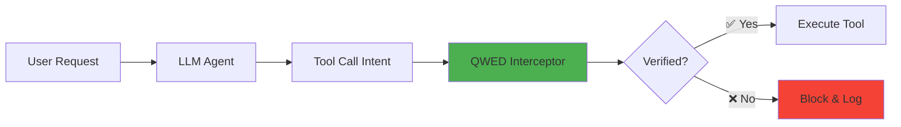

# Module 8: Agentic Integration

> **"The agent doesn't make the decision. It executes verified decisions."**

⏱️ **Duration:** 70 minutes  
📊 **Level:** Advanced  
🎯 **Goal:** Learn to verify AI agent tool calls in real-time streaming workflows.

---

## 🧠 What You'll Learn

After this module, you'll understand:

- ✅ The Interceptor Pattern for tool call verification
- ✅ Commerce safety with UCP (Universal Commerce Protocol)
- ✅ Using TypeScript SDK for Node.js agents
- ✅ Dynamic Discovery with `ucp.json`
- ✅ Streaming verification in agentic loops

---

## 📚 Table of Contents

| Lesson | Topic | Time |
|--------|-------|------|
| 8.1 | [The Interceptor Pattern](#81-the-interceptor-pattern) | 20 min |
| 8.2 | [Commerce Safety (UCP)](#82-commerce-safety-ucp) | 20 min |
| 8.3 | [The Polyglot Agent](#83-the-polyglot-agent-typescript) | 20 min |
| 8.4 | [The Discovery Pattern](#84-the-discovery-pattern) | 10 min |
| 8.5 | [Framework Integrations](#85-framework-integrations) | 15 min |

---

## 8.1: The Interceptor Pattern

### The Problem

Modern AI agents don't just chat—they **execute tools**:

```
User: "Transfer $5000 to account 123456"
Agent: Calls transfer_money(amount=5000, to="123456")
```

**What happens if the LLM hallucinates the amount?**

### The Solution: Verification Middleware



### Implementation with Open Responses

```python
from qwed_finance.integrations import OpenResponsesIntegration

# Create the interceptor
integration = OpenResponsesIntegration()

# Register tools with verification
integration.register_tool(
    name="transfer_money",
    function=actual_transfer_function,
    verifier=lambda params: guard.verify_transfer(
        amount=params["amount"],
        to_account=params["to_account"]
    )
)

# In your agentic loop
async for event in client.responses.create_stream(...):
    if event.type == "tool_call":
        # QWED intercepts and verifies before execution
        result = integration.verify_and_execute(event.tool_call)
        
        if result.blocked:
            print(f"🚫 Blocked: {result.reason}")
        else:
            print(f"✅ Executed: {result.output}")
```

### Key Concept: Never Trust, Always Verify

```python
# ❌ WRONG: Direct execution
def transfer_money(amount, to_account):
    bank.transfer(amount, to_account)  # What if amount is wrong?

# ✅ RIGHT: Verified execution  
def verified_transfer(amount, to_account, expected_amount):
    # Verify the LLM-generated amount matches user intent
    if integration.verify_amount(amount, expected_amount):
        bank.transfer(amount, to_account)
    else:
        raise VerificationError("Amount mismatch detected")
```

### 🔍 Enterprise Pattern: Visual Debugging

When building intercepts, it's hard to see what's happening. Use "Debug Mode" to print the raw Open Responses stream:

```python
# Debugging the Agentic Loop
async for event in client.responses.create_stream(...):
    # Print the raw atomic event
    print(f"DEBUG: [{event.type}] {event.data}")
    
    if event.type == "tool_call":
        # ... verify ...
```

**What you'll see:**
```json
DEBUG: [response.content.delta] {"delta": "I will"}
DEBUG: [response.content.delta] {"delta": " transfer"}
DEBUG: [response.tool_call] {"name": "transfer", "arguments": "{\"amount\": 5000}"}
```

This confirms that QWED sees the **atomic tool call** before it executes.

---

### 🎯 Key Takeaway

> **"Intercept before you execute. Log everything."**

---

## 8.2: Commerce Safety (UCP)

### The Stakes

E-commerce errors are expensive:

| Error | Consequence |
|-------|-------------|
| Wrong cart total | Customer overcharged → Chargebacks |
| Invalid discount | Revenue loss |
| Checkout amount mismatch | Legal liability |
| Failed verification | Cart abandonment |

### Scary Story: The $12,000 Checkout Bug

```
User: "Apply my 20% discount and checkout"

Agent calculated: $1,200 (after 20% off $1,500)
Actual system: $12,000 (bug: applied 20% MARKUP instead)

Result: Customer charged 10x more!
```

### QWED Solution: UCP Integration (Code & Action)

#### 1. Runtime Guard (Python)
Use the `qwed-ucp` library to catch errors *before* the agent commits the transaction:

```python
from qwed_ucp import UCPVerifier

verifier = UCPVerifier()

# Before checkout, verify everything
payment_token = {
    "cart_total": 1200.00,
    "currency": "USD",
    "discount_applied": 0.20,
    "original_total": 1500.00,
    "customer_id": "CUST-12345"
}

# The Verifier checks Money, State, and Structure
result = verifier.verify_checkout(payment_token)

if result.verified:
    # Safe to proceed
    process_payment(payment_token)
    print(f"✅ Payment verified")
else:
    # Block the transaction
    print(f"🚫 Verification failed: {result.error}")
    # Error: "Money Guard: Total mismatch..."
```

#### 2. Pipeline Audit (GitHub Action)
For enterprise safety, audit your transaction logs in CI/CD using our **new GitHub Action**:

```yaml
# .github/workflows/audit_commerce.yml
name: Audit Commerce Logs
on: [push]
jobs:
  audit:
    runs-on: ubuntu-latest
    steps:
      - uses: actions/checkout@v3
      - name: Run QWED Commerce Auditor
        uses: QWED-AI/qwed-ucp@v0.2.0
        with:
          transaction-file: 'logs/transactions.json'
```

This ensures that even if an agent bypasses the runtime check, the **Audit Log** will catch the illegal transaction.

### UCP Capability Discovery

UCP supports **dynamic capability discovery** for agents:

```python
# Agent discovers what verifications are available
capabilities = ucp.get_capability_definition()

print(capabilities)
# {
#   "name": "payment_verification",
#   "version": "1.0",
#   "operations": [
#     "verify_cart_total",
#     "verify_discount",
#     "verify_currency",
#     "verify_aml_flag"
#   ]
# }
```

### 🎯 Key Takeaway

> **"Every checkout is a potential lawsuit. Verify before you charge."**

---

## 8.3: The Polyglot Agent (TypeScript)

### Why TypeScript?

Many production agents run on Node.js:

- Next.js API routes
- Vercel AI SDK
- Express.js backends
- Deno deployments

QWED provides a **TypeScript SDK** that wraps the Python core.

### Installation

```bash
npm install @qwed-ai/finance
```

### Basic Usage

```typescript
import { FinanceVerifier, ComplianceGuard } from '@qwed-ai/finance';

// Verify NPV calculation
const verifier = new FinanceVerifier();

const result = await verifier.verifyNPV({
  cashflows: [-1000, 300, 400, 400, 300],
  rate: 0.10,
  llmOutput: "$180.42"
});

if (result.verified) {
  console.log(`✅ Correct: ${result.computedValue}`);
} else {
  console.log(`❌ Error: Expected ${result.computedValue}, got ${result.llmValue}`);
}
```

### Compliance Verification

```typescript
import { ComplianceGuard } from '@qwed-ai/finance';

const guard = new ComplianceGuard();

// Verify AML flagging
const result = await guard.verifyAMLFlag({
  amount: 15000,
  countryCode: "US",
  llmFlagged: true
});

console.log(`Compliant: ${result.compliant}`);
// Compliant: true (correctly flagged transaction over $10k)
```

### Integration with Vercel AI SDK

```typescript
import { generateText } from 'ai';
import { ComplianceGuard } from '@qwed-ai/finance';

const guard = new ComplianceGuard();

const { text, toolCalls } = await generateText({
  model: yourModel,
  prompt: "Process this wire transfer of $50,000 to Germany",
  tools: {
    wire_transfer: {
      execute: async (params) => {
        // Verify before executing
        const verification = await guard.verifyAMLFlag({
          amount: params.amount,
          countryCode: params.country,
          llmFlagged: params.flagged
        });
        
        if (!verification.compliant) {
          throw new Error(`Blocked: ${verification.reason}`);
        }
        
        return executeTransfer(params);
      }
    }
  }
});
```

### 🎯 Key Takeaway

> **"Your agent's language doesn't matter. Verification is universal."**

---

## 8.4: The Discovery Pattern

### The Problem

Enterprise agents don't live in isolation. They need to be **discovered** by other systems (e.g., a payment gateway finding a verification agent).

Hardcoding URLs (e.g., `http://localhost:8000/verify`) is brittle.

### The Solution: Capability Declaration (`ucp.json`)

UCP uses a manifest file to declare what an agent can do. This allows platforms to automatically route requests to the right verifier.

### Implementation

Create a `ucp.json` in your project root:

```json
{
  "id": "my-banking-agent",
  "name": "Verified Banking Assistant",
  "version": "1.0.0",
  "capabilities": {
    "checkout": {
      "type": "transaction",
      "supported_currencies": ["USD", "EUR"]
    },
    "verification": {
      "provider": "qwed-finance",
      "level": "deterministic",
      "endpoints": {
        "verify_transfer": "/api/verify/transfer",
        "verify_sanctions": "/api/verify/sanctions"
      }
    }
  }
}
```

### How It Works

1. **Deploy:** You push your agent with this file.
2. **Register:** The UCP Registry reads `ucp.json`.
3. **Discover:** A commerce platform asks: *"Who can verify a USD transfer?"*
4. **Route:** The Registry points to your agent's `/api/verify/transfer` endpoint.

### 🎯 Key Takeaway

> **"Don't just build an agent. Build a discoverable service."**

---

## 🧪 Exercise: Prevent the $12K Checkout Error

Build a checkout verification system:

```python
from qwed_finance.integrations import UCPIntegration

def verify_checkout(user_intent, agent_calculation):
    """
    Exercise: Implement checkout verification
    
    Args:
        user_intent: {"original_price": 1500, "discount": "20%"}
        agent_calculation: {"final_price": 12000}  # Bug!
    
    Returns:
        VerificationResult with pass/fail and reason
    """
    ucp = UCPIntegration()
    
    # Your code here:
    # 1. Parse discount from user intent
    # 2. Calculate expected price
    # 3. Compare with agent calculation
    # 4. Return verification result
    pass
```

<details>
<summary><strong>Solution</strong></summary>

```python
def verify_checkout(user_intent, agent_calculation):
    ucp = UCPIntegration()
    
    # Parse discount
    discount_str = user_intent["discount"]
    discount_rate = float(discount_str.replace("%", "")) / 100
    
    # Calculate expected
    original = user_intent["original_price"]
    expected = original * (1 - discount_rate)
    
    # Compare
    agent_price = agent_calculation["final_price"]
    
    if abs(expected - agent_price) < 0.01:
        return {"verified": True, "amount": expected}
    else:
        return {
            "verified": False, 
            "reason": f"Expected ${expected}, got ${agent_price}",
            "blocked": True
        }

# Test
result = verify_checkout(
    {"original_price": 1500, "discount": "20%"},
    {"final_price": 12000}
)
# Output: {"verified": False, "reason": "Expected $1200.0, got $12000", "blocked": True}
```

</details>

---

## 📝 Summary

| Pattern | Use Case | Integration |
|---------|----------|-------------|
| **Interceptor** | Tool call verification | OpenResponsesIntegration |
| **UCP** | E-commerce safety | UCPIntegration |
| **TypeScript** | Node.js agents | @qwed-ai/finance |

---

## 8.5: Framework Integrations

Enterprise developers often define agents using frameworks like LangChain or CrewAI. QWED drops directly into these definitions.

### 🦜 LangChain (Native Tool)

Give your LangChain agent the ability to "ask" for verification:

```python
from qwed_sdk.integrations.langchain import QWEDTool
from langchain.agents import initialize_agent, AgentType
from langchain_openai import ChatOpenAI

# 1. Initialize the Tool
qwed_tool = QWEDTool(provider="openai", model="gpt-4", verify_math=True)

# 2. Add to Agent
llm = ChatOpenAI(temperature=0)
agent = initialize_agent(
    tools=[qwed_tool], 
    llm=llm, 
    agent=AgentType.ZERO_SHOT_REACT_DESCRIPTION,
    verbose=True
)

# 3. Agent now uses QWED automatically
agent.run("Calculate the compound interest on $10k at 5% for 10 years.")
# Agent: "I will use QWED to verify the math..."
```

### 🤖 CrewAI (Verified Role)

Enforce safety constraints on specific agents using the `QWEDVerifiedAgent` class:

```python
from qwed_sdk.integrations.crewai import QWEDVerifiedAgent
from crewai import Task, Crew

# An Analyst that CANNOT hallucinate numbers
analyst = QWEDVerifiedAgent(
    role="Financial Analyst",
    goal="Analyze loan applications",
    backstory="You are a strict compliance officer.",
    allow_dangerous_code=False,  # QWED Code Guard
    verify_math=True             # QWED Math Guard
)

task = Task(description="Analyze this loan...", agent=analyst)
```

### 🦙 LlamaIndex (Query Engine)

Wrap your RAG engine to verify every response against the retrieved context:

```python
from qwed_sdk.integrations.llamaindex import QWEDQueryEngine

# Wrap existing engine
verified_engine = QWEDQueryEngine(
    original_engine,
    verify_facts=True  # RAG Fact Check
)

response = verified_engine.query("What are the payment terms?")
# Returns verified response or raises VerificationError
```

---

## ➡️ Next: Module 9

Now that you can verify agent actions, learn how to **automate verification in CI/CD**:

**[→ Continue to Module 9: DevSecOps](../module-9-devsecops/README.md)**

---

*"Agents execute. QWED verifies. Production stays safe."*
