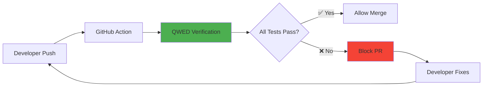

# Module 9: DevSecOps - CI/CD Verification

> **"Shift left. Catch hallucinations in the PR, not in production."**

⏱️ **Duration:** 45 minutes  
📊 **Level:** Advanced  
🎯 **Goal:** Automate AI verification in your CI/CD pipeline using GitHub Actions.

---

## 🧠 What You'll Learn

After this module, you'll understand:

- ✅ Shift-Left Verification philosophy
- ✅ Setting up QWED GitHub Action
- ✅ Blocking PRs that fail verification
- ✅ Generating verification artifacts

---

## 📚 Table of Contents

| Lesson | Topic | Time |
|--------|-------|------|
| 9.1 | [Shift-Left Philosophy](#91-shift-left-verification) | 10 min |
| 9.2 | [GitHub Action Setup](#92-github-action-setup) | 20 min |
| 9.3 | [Branch Protection](#93-branch-protection) | 15 min |

---

## 9.1: Shift-Left Verification

### The Problem

Most teams catch AI errors in production:

```
Developer → Code → Deploy → Production → 🔥 Error → Hotfix
                                              ↑
                                        Too late!
```

### The Solution: Shift Left

Move verification earlier in the pipeline:

```
Developer → Code → PR → CI/CD Verification → ✅ Merge
                              ↑
                        Caught early!
```

### Why This Matters

| When Caught | Cost to Fix |
|-------------|-------------|
| During coding | $1 |
| In PR review | $10 |
| In staging | $100 |
| In production | $1,000+ |
| After customer impact | $10,000+ |

### The QWED Approach



---

## 9.2: GitHub Action Setup

### The QWED Finance Action

QWED provides a ready-to-use GitHub Action for financial AI verification.

**Marketplace:** [QWED Finance Verify](https://github.com/marketplace/actions/qwed-finance-verify)

### Quick Setup

#### Step 1: Create Workflow File

Create `.github/workflows/qwed-verify.yml`:

```yaml
name: QWED Finance Verification

on: [push, pull_request]

jobs:
  verify:
    runs-on: ubuntu-latest
    steps:
      - uses: actions/checkout@v4
      
      - uses: QWED-AI/qwed-finance@v1.2.0
        with:
          file-path: 'tests/transactions.csv'
```

#### Step 2: Create Test CSV

Create `tests/transactions.csv` (Simulate a "Bad Data" trap):

```csv
transaction_id,amount,customer_region,llm_flagged
TXN_001,500,US,False
TXN_002,15000,US,False
```

> ⚠️ **Note:** `TXN_002` is $15,000 but NOT flagged. This is an AML violation.

#### Step 3: Push and Watch

```bash
git add .
git commit -m "Add QWED verification to CI/CD"
git push
```

#### Step 3: Push and Watch

```bash
git add .
git commit -m "Add QWED verification to CI/CD"
git push
```

### Action Inputs

| Input | Description | Default |
|-------|-------------|---------|
| `file-path` | Path to your CSV/JSON file to verify | Required |
| `python-version` | Python version to use | `3.11` |
| `fail-on-violation` | Fail workflow if verification fails | `true` |

### Action Outputs

| Output | Description |
|--------|-------------|
| `verified` | Whether all verifications passed |
| `receipt-count` | Number of verification receipts generated |
| `violations` | JSON array of violations found |

---

## 9.3: Branch Protection

### Block Failing PRs

Configure GitHub to require QWED verification before merge:

1. Go to **Settings → Branches → Add Rule**
2. Enter branch name pattern: `main`
3. Enable **"Require status checks to pass before merging"**
4. Select **"verify"** from the list
5. Save changes

### Result

Now when a PR fails QWED verification:

```
❌ QWED Finance Verification
   └── verify: Failed
       └── Error: AML verification failed!
       
🚫 Merge blocked - Fix required
```

### Verified Badge

Once your workflow passes, add the badge to your README:

```markdown
[](https://github.com/QWED-AI/qwed-finance)
```

---

## 🧪 Hands-On Lab: The "Senior Citizen" Trap

**Scenario:** Ideally, Senior Citizens get +0.50% interest. Claude 4.5 hallucinates the math.

### Lab Goal
Blocking a "Bad PR" that would underpay customers.

### Step 1: Create The Trap

Create a file `rates_update.csv`:

```csv
product,base_rate,senior_margin,claude_output
Senior_FD,7.00,0.50,7.035
```

> **The Error:** Claude did `7.00 * 1.005 = 7.035`.
> **The Truth:** `7.00 + 0.50 = 7.50`.

### Step 2: Push and Watch Fail

Your pipeline will fail because QWED calculates `7.50` but sees `7.035`.

**Result in Actions tab:**
```
❌ Verification Failed: Interest Rate Mismatch
   Expected: 7.50%
   Found: 7.035%
   Error: Multiplicative logic applied to additive spread.
```

### Step 3: Fix the Bug

Update `rates_update.csv`:

```diff
- Senior_FD,7.00,0.50,7.035
+ Senior_FD,7.00,0.50,7.50
```

### Step 4: Push and Watch Pass

**Result:**
```
✅ QWED Finance Verification
   └── verify: Passed
   └── Audited 1 row(s). No hallucinations found.
   
🟢 Ready to merge!
```

---

## 📋 DevSecOps Checklist

| Item | Status |
|------|--------|
| Workflow file created | ☐ |
| Test script written | ☐ |
| Branch protection enabled | ☐ |
| Badge added to README | ☐ |
| Team trained on fixing failures | ☐ |

---

## 📝 Summary

| Concept | Implementation |
|---------|----------------|
| **Shift-Left** | Catch errors in PRs, not production |
| **GitHub Action** | `QWED-AI/qwed-finance@v1.2.0` |
| **Branch Protection** | Require "verify" status to merge |
| **Artifacts** | Verification receipts uploaded |

---

## ➡️ Next: Capstone Project

You've completed all the modules! Now put it all together:

**[→ Start the Capstone Project](../capstone-project/README.md)**

---

*"Production is not a test environment. Verify before you ship."*
