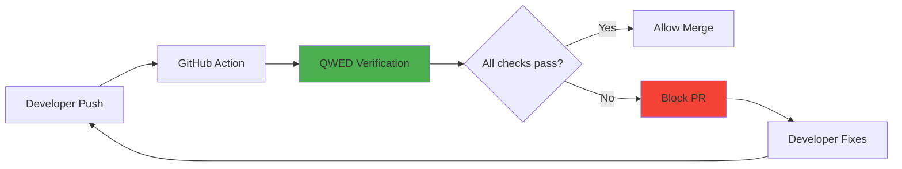

# Module 9: DevSecOps - CI/CD Verification

> **"Shift left. Catch hallucinations in the PR, not in production."**

**Duration:** 45 minutes  
**Level:** Advanced  
**Goal:** Automate AI verification in your CI/CD pipeline using GitHub Actions.

---

## What You'll Learn

After this module, you'll understand:

- Shift-left verification philosophy
- Setting up a QWED verification gate in CI
- Blocking PRs that fail deterministic checks
- Generating verification artifacts for review and audit

---

## Table of Contents

| Lesson | Topic | Time |
|--------|-------|------|
| 9.1 | [Shift-Left Philosophy](#91-shift-left-verification) | 10 min |
| 9.2 | [GitHub Action Setup](#92-github-action-setup) | 20 min |
| 9.3 | [Branch Protection](#93-branch-protection) | 10 min |
| 9.4 | [Modern CI/CD Verification Infrastructure](#94-modern-cicd-verification-infrastructure) | 15 min |

---

## 9.1: Shift-Left Verification

### The Problem

Most teams catch AI errors in production:

```
Developer -> Code -> Deploy -> Production -> Error -> Hotfix
```

That is too late.

### The Solution: Shift Left

Move verification earlier in the pipeline:

```
Developer -> Code -> PR -> CI/CD Verification -> Merge
```

### Why This Matters

| When Caught | Cost to Fix |
|-------------|-------------|
| During coding | $1 |
| In PR review | $10 |
| In staging | $100 |
| In production | $1,000+ |
| After customer impact | $10,000+ |

### The QWED Approach


```mermaid
graph LR
    A[Developer Push] --> B[GitHub Action]
    B --> C[QWED Verification]
    C --> D{All checks pass?}
    D -->|Yes| E[Allow Merge]
    D -->|No| F[Block PR]
    F --> G[Developer Fixes]
    G --> A

    style C fill:#4caf50
    style F fill:#f44336
```

---

## 9.2: GitHub Workflow Setup

### The QWED Verification Gate

For long-lived teams, the stable pattern is to run **your own pinned verification script** inside CI rather than relying on a course-specific marketplace action name.

### Quick Setup

#### Step 1: Create Workflow File

Create `.github/workflows/qwed-verify.yml`:

```yaml
name: QWED Verification Gate

on: [push, pull_request]

jobs:
  verify:
    runs-on: ubuntu-latest
    steps:
      - uses: actions/checkout@v4

      - uses: actions/setup-python@v5
        with:
          python-version: "3.11"

      - name: Install verifier dependencies
        run: pip install qwed-verification==5.1.0

      - name: Run deterministic verification
        run: python .github/scripts/verify_financial_csv.py --input tests/transactions.csv --format sarif --fail-on-error
```

*Note: Treat the workflow above as the durable integration pattern: pin your Python version, pin your verifier dependency, run your own deterministic policy script, and fail the check when proof is unavailable or a violation is found.*

#### Step 2: Create Test CSV

Create `tests/transactions.csv` to simulate a bad-data trap:

```csv
transaction_id,amount,customer_region,llm_flagged
TXN_001,500,US,False
TXN_002,15000,US,False
```

**Note:** `TXN_002` is `$15,000` but not flagged. This is an AML violation.

#### Step 3: Create the Verification Script

Copy the sample verifier from this module into your repository:

```bash
mkdir -p .github/scripts
cp module-9-devsecops/lab-files/verify_financial_csv.py .github/scripts/verify_financial_csv.py
```

The sample script demonstrates a deterministic gate for:
- AML threshold checks (`amount >= 10000` must be flagged)
- additive rate calculations for the senior-citizen lab
- the shipped rate CSV schema used in this repo
- `qwed-verification==5.1.0`, which is the tested dependency pin for this example

#### Step 4: Push and Watch

```bash
git add .
git commit -m "Add QWED verification to CI/CD"
git push
```

### Workflow Outputs

Your pipeline should publish two kinds of artifacts:

| Output | Description |
|--------|-------------|
| `verification.sarif` | Structured findings for GitHub code scanning |
| `verification-report.json` | Full policy results, receipts, or audit metadata |

---

## 9.3: Branch Protection

### Block Failing PRs

Configure GitHub to require QWED verification before merge:

1. Go to **Settings -> Branches -> Add Rule**
2. Enter branch name pattern: `main`
3. Enable **"Require status checks to pass before merging"**
4. Select **"verify"** from the list
5. Save changes

### Result

Now when a PR fails QWED verification:

```text
X QWED Verification Gate
  -> verify: Failed
     -> Error: AML verification failed

Merge blocked - Fix required
```

## Hands-On Lab: The "Senior Citizen" Trap

**Scenario:** Senior citizens get `+0.50 percentage points` as an additive spread, not a multiplicative `0.50%` increase. Claude 4.5 hallucinates the math.

### Lab Goal

Block a bad PR that would underpay customers.

### Step 1: Create the Trap

Create or reuse `rates_update.csv`:

```csv
product_name,base_rate,senior_margin,claude_generated_final_rate
Standard FD,7.00,0.00,7.00
Senior FD,7.00,0.50,7.035
```

**The Error:** Claude treated the senior margin as a multiplicative increase and did `7.00 * 1.005 = 7.035`.  
**The Truth:** The senior margin is additive, so `7.00 + 0.50 = 7.50`.

### Step 2: Push and Watch Fail

Your pipeline will fail because QWED calculates `7.50` but sees `7.035`.

**Result in the Actions tab:**

```text
X Verification Failed: Interest Rate Mismatch
  Expected: 7.50%
  Found: 7.035%
  Error: Multiplicative logic applied to additive spread.
```

### Step 3: Fix the Bug

Update `rates_update.csv`:

```diff
- Senior FD,7.00,0.50,7.035
+ Senior FD,7.00,0.50,7.50
```

### Step 4: Push and Watch Pass

**Result:**

```text
QWED Finance Verification
  -> verify: Passed
  -> Audited 2 row(s). No additive-rate violations found.

Ready to merge.
```

---

## DevSecOps Checklist

| Item | Status |
|------|--------|
| Workflow file created | [ ] |
| Test script written | [ ] |
| Branch protection enabled | [ ] |
| Badge added to README | [ ] |
| Team trained on fixing failures | [ ] |

---

## 9.4: Modern CI/CD Verification Infrastructure

Current QWED-style CI/CD programs usually combine deterministic verification with standard supply-chain and observability tooling:

### The Stack

| Tool | Purpose | Integration |
|------|---------|-------------|
| **Sentry** | Real-time error tracking | `sentry-sdk` in Python |
| **CircleCI** | Matrix testing (Python 3.10-3.12) | `.circleci/config.yml` |
| **SonarCloud** | Code quality + coverage analysis | GitHub App |
| **Snyk** | Security vulnerability scanning (SARIF) | `snyk test` / `snyk monitor` |
| **pip-audit** | Python dependency CVE scanning | `pip-audit --strict` |
| **Docker Scout** | Container vulnerability scanning | Docker Hub integration |
| **SBOM** | Software Bill of Materials (SPDX) | `anchore/sbom-action` |

### Docker Auto-Publish Pipeline

```yaml
# Automated on every GitHub Release
# 1. Build multi-platform image
# 2. Sign with pinned base image digests
# 3. Generate SBOM (SPDX format)
# 4. Push to Docker Hub with version tags
# 5. Run Docker Scout vulnerability scan
```

### Key Practices

1. **pip-audit with exclusions** - Exclude local packages from audit (`--exclude qwed`)
2. **Non-root Docker** - All containers run as non-root user via `gosu` / `runuser`
3. **Hash-verified requirements** - Use `pip install --require-hashes` in Docker builds
4. **SARIF output** - Export Snyk results as SARIF for the GitHub Security tab

### Key Takeaway

> **"One scanner is hope. A deterministic gate plus layered CI evidence is infrastructure."**

---

## Summary

| Concept | Implementation |
|---------|----------------|
| **Shift-Left** | Catch errors in PRs, not production |
| **Verification Gate** | Pinned workflow + deterministic verification script |
| **Branch Protection** | Require `verify` status to merge |
| **Artifacts** | Verification records uploaded |
| **Sentry** | Error tracking in production |
| **Snyk + pip-audit** | Dependency CVE scanning |
| **SBOM** | Software supply chain transparency |

---

## Next: Advanced Patterns

Learn the advanced verification engines - Fact Checker, Consensus, and Reasoning:

**[Continue to Module 10: Advanced Patterns](../module-10-advanced-patterns/README.md)**

---

*"Production is not a test environment. Verify before you ship."*
