# Module 9: DevSecOps - CI/CD Verification

> **"Shift left. Catch hallucinations in the PR, not in production."**

⏱️ **Duration:** 45 minutes  
📊 **Level:** Advanced  
🎯 **Goal:** Automate AI verification in your CI/CD pipeline using GitHub Actions.

---

## 🧠 What You'll Learn

After this module, you'll understand:

- ✅ Shift-Left Verification philosophy
- ✅ Setting up QWED GitHub Action
- ✅ Blocking PRs that fail verification
- ✅ Generating verification artifacts

---

## 📚 Table of Contents

| Lesson | Topic | Time |
|--------|-------|------|
| 9.1 | [Shift-Left Philosophy](#91-shift-left-verification) | 10 min |
| 9.2 | [GitHub Action Setup](#92-github-action-setup) | 20 min |
| 9.3 | [Branch Protection](#93-branch-protection) | 15 min |

---

## 9.1: Shift-Left Verification

### The Problem

Most teams catch AI errors in production:

```
Developer → Code → Deploy → Production → 🔥 Error → Hotfix
                                              ↑
                                        Too late!
```

### The Solution: Shift Left

Move verification earlier in the pipeline:

```
Developer → Code → PR → CI/CD Verification → ✅ Merge
                              ↑
                        Caught early!
```

### Why This Matters

| When Caught | Cost to Fix |
|-------------|-------------|
| During coding | $1 |
| In PR review | $10 |
| In staging | $100 |
| In production | $1,000+ |
| After customer impact | $10,000+ |

### The QWED Approach

```mermaid
graph LR
    A[Developer Push] --> B[GitHub Action]
    B --> C[QWED Verification]
    C --> D{All Tests Pass?}
    D -->|✅ Yes| E[Allow Merge]
    D -->|❌ No| F[Block PR]
    F --> G[Developer Fixes]
    G --> A
    
    style C fill:#4caf50
    style F fill:#f44336
```



---

## 9.2: GitHub Action Setup

### The QWED Finance Action

QWED provides a ready-to-use GitHub Action for financial AI verification.

**Marketplace:** [QWED Finance Verify](https://github.com/marketplace/actions/qwed-finance-verify)

### Quick Setup

#### Step 1: Create Workflow File

Create `.github/workflows/qwed-verify.yml`:

```yaml
name: QWED Finance Verification

on: [push, pull_request]

jobs:
  verify:
    runs-on: ubuntu-latest
    steps:
      - uses: actions/checkout@v4
      
      - uses: QWED-AI/qwed-finance@v1.1.4
        with:
          test-script: tests/verify_agent.py
```

#### Step 2: Create Test Script

Create `tests/verify_agent.py`:

```python
"""
QWED Verification Tests for Your Banking Agent
"""
from qwed_finance import ComplianceGuard, FinanceVerifier

def test_aml_compliance():
    """Test that AML flagging works correctly"""
    guard = ComplianceGuard()
    
    # Test: Large transaction should be flagged
    result = guard.verify_aml_flag(
        amount=15000,  # Over $10k threshold
        country_code="US",
        llm_flagged=True
    )
    
    assert result.compliant, "AML verification failed!"
    print("✅ AML compliance test passed")

def test_npv_calculation():
    """Test that NPV calculations are correct"""
    verifier = FinanceVerifier()
    
    result = verifier.verify_npv(
        cashflows=[-1000, 300, 400, 400, 300],
        rate=0.10,
        llm_output="$180.42"
    )
    
    assert result.verified, f"NPV mismatch: expected {result.computed_value}"
    print("✅ NPV calculation test passed")

def test_loan_calculation():
    """Test monthly payment calculation"""
    verifier = FinanceVerifier()
    
    result = verifier.verify_monthly_payment(
        principal=500000,
        annual_rate=0.065,
        months=360,
        llm_output="$3160.34"
    )
    
    assert result.verified, f"Loan calculation wrong: {result.computed_value}"
    print("✅ Loan calculation test passed")

if __name__ == "__main__":
    test_aml_compliance()
    test_npv_calculation()
    test_loan_calculation()
    print("\n🎉 All verification tests passed!")
```

#### Step 3: Push and Watch

```bash
git add .
git commit -m "Add QWED verification to CI/CD"
git push
```

### Action Inputs

| Input | Description | Default |
|-------|-------------|---------|
| `test-script` | Path to your Python test script | Required |
| `python-version` | Python version to use | `3.11` |
| `fail-on-violation` | Fail workflow if verification fails | `true` |

### Action Outputs

| Output | Description |
|--------|-------------|
| `verified` | Whether all verifications passed |
| `receipt-count` | Number of verification receipts generated |
| `violations` | JSON array of violations found |

---

## 9.3: Branch Protection

### Block Failing PRs

Configure GitHub to require QWED verification before merge:

1. Go to **Settings → Branches → Add Rule**
2. Enter branch name pattern: `main`
3. Enable **"Require status checks to pass before merging"**
4. Select **"verify"** from the list
5. Save changes

### Result

Now when a PR fails QWED verification:

```
❌ QWED Finance Verification
   └── verify: Failed
       └── Error: AML verification failed!
       
🚫 Merge blocked - Fix required
```

### Verified Badge

Once your workflow passes, add the badge to your README:

```markdown
[](https://github.com/QWED-AI/qwed-finance)
```

---

## 🧪 Hands-On Lab: Watch a PR Fail Then Pass

### Lab Goal

1. Create a "bad" test that fails
2. See the PR blocked
3. Fix the test
4. See the PR pass

### Step 1: Create Bad Test

```python
# tests/verify_agent.py
from qwed_finance import ComplianceGuard

def test_bad_aml():
    """This test should FAIL - wrong value"""
    guard = ComplianceGuard()
    
    # ❌ BUG: llm_flagged=False but amount is over $10k!
    result = guard.verify_aml_flag(
        amount=15000,
        country_code="US",
        llm_flagged=False  # Wrong! Should be True
    )
    
    assert result.compliant, "AML check failed"

if __name__ == "__main__":
    test_bad_aml()
```

### Step 2: Push and Watch Fail

```bash
git add .
git commit -m "Add AML test (has bug)"
git push
```

**Result in Actions tab:**
```
❌ Error: AML check failed
    Amount $15,000 requires flagging but LLM said False
```

### Step 3: Fix the Bug

```python
def test_bad_aml():
    guard = ComplianceGuard()
    
    # ✅ FIXED: Correctly flagged
    result = guard.verify_aml_flag(
        amount=15000,
        country_code="US",
        llm_flagged=True  # Fixed!
    )
    
    assert result.compliant, "AML check failed"
```

### Step 4: Push and Watch Pass

```bash
git add .
git commit -m "Fix AML test - correct flagging"
git push
```

**Result:**
```
✅ QWED Finance Verification
   └── verify: Passed
   └── Receipts: 1 generated
   
🟢 Ready to merge!
```

---

## 📋 DevSecOps Checklist

| Item | Status |
|------|--------|
| Workflow file created | ☐ |
| Test script written | ☐ |
| Branch protection enabled | ☐ |
| Badge added to README | ☐ |
| Team trained on fixing failures | ☐ |

---

## 📝 Summary

| Concept | Implementation |
|---------|----------------|
| **Shift-Left** | Catch errors in PRs, not production |
| **GitHub Action** | `QWED-AI/qwed-finance@v1.1.4` |
| **Branch Protection** | Require "verify" status to merge |
| **Artifacts** | Verification receipts uploaded |

---

## ➡️ Next: Capstone Project

You've completed all the modules! Now put it all together:

**[→ Start the Capstone Project](../capstone-project/README.md)**

---

*"Production is not a test environment. Verify before you ship."*
